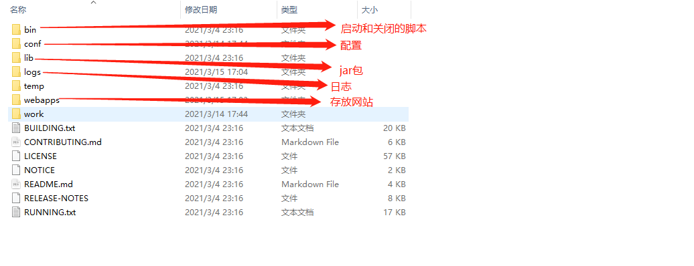

# 1 Web的基本概念

  ## 1.1 前言

web开发：

- web，网页的意思 www.baidu.com

- 静态web

  - html、css
  - 提供给所有人看的数据始终不会发生变化！

- 动态web

  - 淘宝，几乎是所有的网站。
  - 提供给所有人看的数据始终会发生变化，每个人在不同的时间，不同的地点看到的信息各不相同。
  - 技术栈：servlet/JSP，ASP，PHP

  在java中，动态web资源开发的技术统称为JavaWeb

## 1.2 web应用程序

web应用程序：可以提供浏览器访问的程序

- a.html 、b.html ... 多个web资源，这些web资源可以被外界访问，对外界提供服务。
- 你能访问到的任何一个页面或者资源，都存在于这个世界的某一个角落的计算机上。
- URL: 统一资源定位符
- 这个统一的web资源会被放在同一个文件夹下，这就是web应用程序，依赖于tomcat:服务器
- 一个web应用由多部分组成（静态web，动态web）
  - html,css,js
  - jsp,servlet
  - java程序
  - jar包
  - 配置文件（Properties）

web应用编写完毕后，若想提供给外界访问，需要一个服务器来统一管理。

## 1.3 静态web

- `*.htm,*.html`这些都是网页的后缀，如果服务器上一直存在这些东西，我们就可以直接进行读取。
- 静态web存在缺点
  - web页面无法动态更新，所有用户看到都是同一个页面
    - 轮播图，点击特效：伪动态
    - JavaScript【实际开发中，它用的最多】
    - VBScript
  - 它无法和数据库交互（数据无法持久化，用户无法交互）

## 1.4 动态web

页面会动态展示：**web的页面展示的效果因人而异**

缺点：

- 假如服务器的动态资源出现了错误，我们需要重新编写我们的后台程序，重新发布。
  - 停机维护

优点：

- web页面可以动态更新，所有用户都可以看到不同的页面
- 它可以与数据库交互（数据持久化: 注册用户，商品信息等）

# 2 web服务器讲解

## 2.1 技术讲解

**ASP:**

- 微软：国内最早流行的就是ASP
- 在html中嵌入了VB的脚本，ASP+COM
- 在ASP开发中，基本一个页面都是几千行的业务代码，页面极其乱
- 维护成本高
- C#
- IIS

**PHP:**

- PHP开发速度很快，功能很强大，跨平台，代码很简单
- 无法承载大访问量的情况（局限性）

**JSP/Servlet:**

B/S:浏览器和服务器

C/S:客户端和服务器

- sun公司主推的B/S架构
- 基于java语言的（所有的大公司，或者一些开源的组件，都是用java写的）
- 可以承载三高问题带来的影响
- 语法像ASP

## 2.2 web服务器

服务器是一种被动的操作，用来处理用户的一些请求和给用户一些响应信息

**IIS**：微软的 windows中自带的

**Tomcat**


Tomcat是Apache 软件基金会（Apache Software Foundation）的Jakarta 项目中的一个核心项目，最新的Servlet 和JSP 规范总是能在Tomcat 中得到体现。因为Tomcat 技术先进、性能稳定，而且免费，因而深受Java 爱好者的喜爱并得到了部分软件开发商的认可，成为目前比较流行的Web 应用服务器。

Tomcat 服务器是一个免费的开放源代码的Web 应用服务器，属于轻量级应用服务器，在中小型系统和并发访问用户不是很多的场合下被普遍使用，是开发和调试JSP 程序的首选。对于一个java初学web的人来说，它是最佳的选择。

诀窍是，当配置正确时，Apache 为HTML页面服务，而Tomcat 实际上运行JSP 页面和Servlet，最新版本为9.0。

**工作3-5年之后，可以尝试手写tomcat服务器。**

下载tomcat:

1. 安装 or 解压
2. 了解配置文件及目录结构
3. 这个东西的作用

# 3 tomcat详解

## 3.1 安装tomcat

官网：https://tomcat.apache.org/


解压


## 3.2 tomcat启动和配置



**启动，关闭tomcat**


访问测试：http://localhost:8080/

可能遇到的问题：

1. java环境变量没有配置
2. 闪退问题：需要配置兼容性
3. 乱码问题：配置文件中设置

## 3.3 配置


可以配置启动的端口号

- tomcat的默认端口为：8080

- mysql默认端口：3306

- http默认端口：80

- https默认端口：443

  ```xml
  <Connector port="8080" protocol="HTTP/1.1"
             connectionTimeout="20000"
             redirectPort="8443" />
  ```

可以配置主机的名称

- 默认的主机名为：localhost --- 127.0.0.1
- 默认网站应用存放的位置为webapps

```xml
<Host name="localhost"  appBase="webapps"
		unpackWARs="true" autoDeploy="true">
```

**高难度面试题：**

请你谈谈网站是如何进行访问的?

1. 输入一个域名；回车
2. 检查本机的配置文件C:\Windows\System32\drivers\etc\hosts下有没有这个域名的映射
   1. 有：直接返回对应的ip地址,这个地址中，有我们需要放的web程序，可以直接访问
   2. 没有：去DNS服务器找，找到的话就返回，找不到就返回找不到

3. 可以配置一下环境变量（可选项）

## 3.4 发布一个web网站

不会就先模仿

- 将自己写的网站，放到服务器（tomcat）中指定的web应用的文件夹（webapps）下，就可以访问了

网站应该有的结构

- webapps : tomcat服务器的web目录
  - ROOT
  - thecw : 网站的目录名
    - WEB-INF
      - classes : java程序
      - lib ： web应用所依赖的jar包
      - web.xml ： 网站配置文件
    - index.html ： 默认的首页
    - static
      - css
        - style.css
      - js
      - img
    - ...

# 4 http

## 4.1 什么是HTPP

超文本传输协议（Hyper Text Transfer Protocol，HTTP）是一个简单的请求-响应协议，它通常运行在TCP之上。

- 文本：html,字符串...
- 超文本：用超链接的方法，将各种不同空间的文字信息组织在一起的网状文本。更是一种用户界面范式，用以显示文本及与文本之间相关的内容。
- 端口号：80

HTTPS：安全的

- 端口号：443

## 4.2 两个时代

- http1.0
  - HTTP/1.0 : 客户端可以与web服务器连接后，只能获得一个web资源，断开连接
- http2.0
  - HTTP/1.1：客户端可以与web服务器连接后，可以获得多个web资源。

## 4.3 Http请求

- 客户端---发送请求（Request）--服务器

- 客户端---发送请求（Request）--服务器

百度：

```java
Request URL: https://www.baidu.com/    请求地址
Request Method: GET     get方法/post方法
Status Code: 200 OK     状态码：200
Remote Address: 14.215.177.38:443    远程地址
Accept: text/html,application/xhtml+xml,application/xml;q=0.9,image/avif,image/webp,image/apng,*/*;q=0.8,application/signed-exchange;v=b3;q=0.9
Accept-Encoding: gzip, deflate, br
Accept-Language: zh-CN,zh;q=0.9
Cache-Control: no-cache
Connection: keep-alive
Cookie: BIDUPSID=E915D8DAC0FCA4159DF81414176EBD43; PSTM=1618281055; BAIDUID=E915D8DAC0FCA415F0B2ABB582D30135:FG=1; __yjs_duid=1_042d578ea86bfb698f35ffbf7e97f5ff1619488718760; BAIDUID_BFESS=E915D8DAC0FCA415F0B2ABB582D30135:FG=1; COOKIE_SESSION=16414_3_8_4_7_1_1_0_7_1_0_0_16416_0_3_0_1625410778_1625394325_1625410775%7C9%2379260_3_1625394323%7C2; BD_LAST_QID=9581266030928333830
Host: www.baidu.com
```

### 4.3.1 请求行

- 请求行中的请求方式：GET
- 请求方式：**GET, POST,** HEAD, DELETE, PUT, TRACT...
  - get：请求能够携带的参数比较少，大小有限制，会在浏览器的URL地址拦显示数据内容，不安全，但是高效
  - post：请求能都携带的参数没有限制，大小没有限制，不会再在浏览器的URL地址拦显示数据内容，安全，但是不高效。

### 4.3.2 消息头

```properties
Accept: 告诉浏览器，它所支持的类型
Accept-Encoding: 支持哪种编码格式  GBK  UTF-8 GB2312  ISO8859-1
Accept-Language: 告诉浏览器，它的语言环境
Cache-Control: 缓存控制
Connection: 告诉浏览器，请求完成是断开还是保持连接
Host:主机
```

##  4.4 Http响应

- 服务器---响应---客户端

百度：

```properties
Cache-Control: private                 缓存控制
Connection: keep-alive                 连接保持
Content-Encoding: gzip                 编码
Content-Type: text/html;charset=utf-8  类型
```

### 4.4.1 响应体

```properties
Accept: 高速浏览器，它所支持的类型
Accept-Encoding: 支持哪种编码格式  GBK  UTF-8 GB2312  ISO8859-1
Accept-Language: 告诉浏览器，它的语言环境
Cache-Control: 缓存控制
Connection: 告诉浏览器，请求完成是断开还是保持连接
Host:主机
Refresh:高速客户端，多久刷新一次
Location:让网页重新定位
```

### 4.4.2 响应状态码

200：请求响应成功

3xx：请求重定向

- 重定向：你重新到我给你的新位置去

4xx：找不到资源 404

- 资源不存在

5xx：服务器代码错误 500 502（网关错误）

**常见面试题：**

当你的浏览器中地址拦输入地址并回车的一瞬间到页面能够展示回来，经历了什么？

# 5 Maven

我们为什么要学习这个技术？

1. 在javaweb开发中，需要使用大量的jar，我们手动去导入

2. 如何能够让一个东西自动帮我导入和配置这个jar包

   由此，Maven诞生了！

## 5.1 Maven 项目架构管理工具

我们目前就是方便导入jar包的

Maven的核心思想：**约定大于配置**

- 有约束，不要去违反

Maven会规定好你该如何取编写我们的java代码，必须要按照这个规范来。

## 5.2 下载安装 Maven

官网：https://maven.apache.org/


下载完成后，解压即可

友情建议：电脑上的所有环境都放到一个文件夹下，方便管理

##  5.3 环境变量配置

在我们的系统环境变量中

配置如下配置：

- M2_HOME maven目录下的bin目录
- MAVEN_HOME maven的目录
- 在系统的Path中配置 %MAVEN_HOME%\bin


测试Maven是否安装成功，保证必须配置完毕！

###  5.4阿里云镜像

- 镜像：mirrors
  - 作用：加速我们的下载
- 国内建议使用阿里云的镜像

```xml
<mirror>
    <id>nexus-aliyun</id>
    <mirrorOf>*,!jeecg,!jeecg-snapshots</mirrorOf>
    <name>Nexus aliyun</name>
   	<url>http://maven.aliyun.com/nexus/content/groups/public</url> 
</mirror>
```

### 5.5本地仓库

在本地的仓库，远程仓库；

**建立一个本地仓库：**localRepository

```xml
<localRepository>F:\Environment\apache-maven-3.8.4\maven-repo</localRepository>
```

# 6 idea中的maven操作 

## 6.1创建一个maven项目

1. 启动IDEA

2. 创建一个maven web项目

   

   

   

   

3. 等待项目初始化完毕

   

   

4. 观察maven仓库中多了什么东西？

5. idea中maven设置

   idea项目创建成功后，看一眼Maven的配置

   

   

6. 到这里，maven在idea中的配置和使用就ok了

## 6.2 创建一个普通的maven项目


这个只有在web应用下才会有


## 6.3 标记文件夹功能

**方法【1】**


**方法【2】**


## 6.4 在idea中配置tomcat

1. 点击下面这里

   

2. 点击加号，【tomcat service】 -->【local】

   

3. 配置 tomcat服务器

   

   

   

4. 启动 tomcat

   

   

## 6.5 POM文件

pom.xml是maven的核心配置文件


```xml
<?xml version="1.0" encoding="UTF-8"?>
<!--maven版本和头文件-->
<project xmlns="http://maven.apache.org/POM/4.0.0" xmlns:xsi="http://www.w3.org/2001/XMLSchema-instance"
         xsi:schemaLocation="http://maven.apache.org/POM/4.0.0 http://maven.apache.org/xsd/maven-4.0.0.xsd">
  <modelVersion>4.0.0</modelVersion>

  <!--这里就是我们配置的gav-->
  <groupId>com.zyy</groupId>
  <artifactId>javaweb-maven</artifactId>
  <version>1.0-SNAPSHOT</version>
  <!--packaging  项目的方法方式
    jar:jar应用
    war:javaWeb应用
  -->
  <packaging>war</packaging>

  <name>javaweb-maven Maven Webapp</name>
  <!-- FIXME change it to the project's website -->
  <url>http://www.example.com</url>

  <!--配置-->
  <properties>
    <!--项目的默认构建编码-->
    <project.build.sourceEncoding>UTF-8</project.build.sourceEncoding>
    <!--编码版本-->
    <maven.compiler.source>1.8</maven.compiler.source>
    <maven.compiler.target>1.8</maven.compiler.target>
  </properties>

  <!--项目依赖-->
  <dependencies>
    <dependency>
      <groupId>junit</groupId>
      <artifactId>junit</artifactId>
      <version>4.11</version>
      <scope>test</scope>
    </dependency>
  </dependencies>

  <!--项目构建用的东西-->
  <build>
    <finalName>javaweb-maven</finalName>
    <pluginManagement><!-- lock down plugins versions to avoid using Maven defaults (may be moved to parent pom) -->
      <plugins>
        <plugin>
          <artifactId>maven-clean-plugin</artifactId>
          <version>3.1.0</version>
        </plugin>
        <!-- see http://maven.apache.org/ref/current/maven-core/default-bindings.html#Plugin_bindings_for_war_packaging -->
        <plugin>
          <artifactId>maven-resources-plugin</artifactId>
          <version>3.0.2</version>
        </plugin>
        <plugin>
          <artifactId>maven-compiler-plugin</artifactId>
          <version>3.8.0</version>
        </plugin>
        <plugin>
          <artifactId>maven-surefire-plugin</artifactId>
          <version>2.22.1</version>
        </plugin>
        <plugin>
          <artifactId>maven-war-plugin</artifactId>
          <version>3.2.2</version>
        </plugin>
        <plugin>
          <artifactId>maven-install-plugin</artifactId>
          <version>2.5.2</version>
        </plugin>
        <plugin>
          <artifactId>maven-deploy-plugin</artifactId>
          <version>2.8.2</version>
        </plugin>
      </plugins>
    </pluginManagement>
  </build>
</project>
```

**maven的高级之初在于它会帮你导入这个jar包所依赖的其他jar包**

maven由于他的约定大于配置，我们之后可能会遇到我们写的配置文件，无法被导出或者生效的问题，解决方案：

```xml
  <!--在build中配置resources,来防止我们资源导出失败的问题-->  
  <build> 
    <resources>
      <resource>
        <directory>src/main/resources</directory>
        <includes>
          <include>**/*.properties</include>
          <include>**/*.xml</include>
        </includes>
        <filtering>true</filtering>
      </resource>
      <resource>
        <directory>src/main/java</directory>
        <includes>
          <include>**/*.properties</include>
          <include>**/*.xml</include>
        </includes>
        <filtering>true</filtering>
      </resource>
    </resources>
  </build>
```

## 6.6 idea操作

目录树


maven中jar的联系关联图


# 7 解决大家遇到的一些问题

1. maven 3.6.2

   报错：unable to import maven project:see logs for details

   解决方法：降级为3.6.1

2. tomcat闪退

3. idea中每次都要重复配置maven

   在idea中的全局默认配置中去配置

   

4. maven项目中tomcat无法配置

5. maven默认web项目中的web.xml版本问题

   

   替换为webapp3.1版本和tomcat一致(看tomcat下的webapps里面的官方案例)

   ```xml
   <?xml version="1.0" encoding="UTF-8"?>
   <web-app xmlns="https://jakarta.ee/xml/ns/jakartaee"
            xmlns:xsi="http://www.w3.org/2001/XMLSchema-instance"
            xsi:schemaLocation="https://jakarta.ee/xml/ns/jakartaee
                         https://jakarta.ee/xml/ns/jakartaee/web-app_5_0.xsd"
            version="5.0"
            metadata-complete="true">
     
   </web-app>
   ```

6. maven仓库的使用

   地址：https://mvnrepository.com/

   

   

   

#  8 HelloServlet

###  8.1 servlet简介

- servlet就是sun公司开发动态web的一门技术
- sun在这些api中提供一个接口叫做：servlet，如果你想开发一个servlet程序，只需要完成两个小步骤：
  - 编写一个类，实现servlet接口
  - 把开发好的java类部署到web服务器中

**把实现了servlet接口的java程序叫做，servlet**

### 8.2 HelloServlet

**servlet接口sun公司有两个默认的实现类：HttpServlet、GenericServlet**

1. 建立一个普通的maven项目，删除src目录


1. 然后在此项目中，新建一个module(javaweb maven项目)

   关于maven父子工程的理解：

   父项目中会有

   ```xml
       <modules>
           <module>servlet-01</module>
       </modules>
   ```

   子项目中会有

   ```xml
       <parent>
           <artifactId>javaWeb-03-maven</artifactId>
           <groupId>com.zyy</groupId>
           <version>1.0-SNAPSHOT</version>
       </parent>
   ```

   父项目中的jar包子项目可以直接使用

   ```java
   son extends father
   ```

   

   导servlet包（父项目POM文件中）

   ```xml
   <?xml version="1.0" encoding="UTF-8"?>
   <project xmlns="http://maven.apache.org/POM/4.0.0"
            xmlns:xsi="http://www.w3.org/2001/XMLSchema-instance"
            xsi:schemaLocation="http://maven.apache.org/POM/4.0.0 http://maven.apache.org/xsd/maven-4.0.0.xsd">
       <modelVersion>4.0.0</modelVersion>
   
       <groupId>com.zyy</groupId>
       <artifactId>javaWeb-03-maven</artifactId>
       <packaging>pom</packaging>
       <version>1.0-SNAPSHOT</version>
       <modules>
           <module>servlet-01</module>
       </modules>
       <dependencies>
           <dependency>
               <groupId>jakarta.servlet.jsp</groupId>
               <artifactId>jakarta.servlet.jsp-api</artifactId>
               <version>3.0.0</version>
           </dependency>
           <dependency>
               <groupId>jakarta.servlet</groupId>
               <artifactId>jakarta.servlet-api</artifactId>
               <version>5.0.0</version>
           </dependency>
   
       </dependencies>
   
   </project>
   ```
   
   1. maven环境优化
   
      1. 修改web.xml为最新的
   
         ```xml
         <?xml version="1.0" encoding="UTF-8"?>
         <web-app xmlns="https://jakarta.ee/xml/ns/jakartaee"
                  xmlns:xsi="http://www.w3.org/2001/XMLSchema-instance"
                  xsi:schemaLocation="https://jakarta.ee/xml/ns/jakartaee
                               https://jakarta.ee/xml/ns/jakartaee/web-app_5_0.xsd"
                  version="5.0"
                  metadata-complete="true">
         </web-app>
         ```
   
      2. 将maven的结构搭建完整
   
         
   
   2. 编写一个servlet程序
   
      编写一个普通类，实现servlet接口，这里我们直接继承HttpServlet
   
      
   
      ```java
      package com.cw.servlet;
      
      import jakarta.servlet.http.HttpServlet;
      import jakarta.servlet.http.HttpServletRequest;
      import jakarta.servlet.http.HttpServletResponse;
      
      import java.io.IOException;
      import java.io.PrintWriter;
      
      public class HelloServlet extends HttpServlet {
      
          @Override
          protected void doGet(HttpServletRequest req, HttpServletResponse response) throws ServletException, IOException {
              response.setContentType("text/html");
              response.setCharacterEncoding("utf-8");
              PrintWriter out = response.getWriter();
              out.println("<html>");
              out.println("<head>");
              out.println("<title>Hello World!</title>");
              out.println("</head>");
              out.println("<body>");
              out.println("<h1>你好！</h1>");
              out.println("</body>");
              out.println("</html>");
          }
      
          @Override
          protected void doPost(HttpServletRequest req, HttpServletResponse resp) throws ServletException, IOException {
              doGet(req, resp);
          }
      }
      ```
   
   3. 编写一个servlet的映射
   
      **为什么需要映射：我们写的是java程序，但是要通过浏览器访问，而浏览器需要连接web服务器，所以我们需要在web服务中注册我们写的servlet，还需要给他一个浏览器能够访问的路径。**
   
      ```xml
      <?xml version="1.0" encoding="UTF-8"?>
      <web-app xmlns="http://xmlns.jcp.org/xml/ns/javaee"
               xmlns:xsi="http://www.w3.org/2001/XMLSchema-instance"
               xsi:schemaLocation="http://xmlns.jcp.org/xml/ns/javaee
                            http://xmlns.jcp.org/xml/ns/javaee/web-app_3_1.xsd"
               version="3.1"
               metadata-complete="true">
      
          <display-name>Welcome to Tomcat</display-name>
          <!--  web.xml是配置我们web的核心应用-->
          <!--  注册servlet-->
          <servlet>
              <servlet-name>helloServlet</servlet-name>
              <servlet-class>com.zyy.servlet.HelloServlet</servlet-class>
          </servlet>
          <!--  一个servlet对应一个Mapping:映射-->
          <servlet-mapping>
              <servlet-name>helloServlet</servlet-name>
              <!--    请求路径-->
              <url-pattern>/hello</url-pattern>
          </servlet-mapping>
      
      </web-app>
      ```
   
   4. 配置tomcat
   
      注意：配置项目发布的路径
   
      
   
   5. 测试
   
      

# 9 servlet原理

servlet是由web服务器调用


## 9.1 Mapping问题

1. 一个servlet可以指定一个映射路径

   ```xml
     <!--  一个servlet对应一个Mapping:映射-->
     <servlet-mapping>
       <servlet-name>helloServlet</servlet-name>
       <!--    请求路径-->
       <url-pattern>/hello</url-pattern>
     </servlet-mapping>
   ```

2. 一个servlet可以指定多个映射路径

   ```xml
     <servlet-mapping>
       <servlet-name>helloServlet</servlet-name>
       <url-pattern>/hello</url-pattern>
     </servlet-mapping>
     <servlet-mapping>
       <servlet-name>helloServlet</servlet-name>
       <url-pattern>/hello2</url-pattern>
     </servlet-mapping>
   ```

3. 一个servlet可以指定通用映射路径

   ```xml
     <servlet-mapping>
       <servlet-name>helloServlet</servlet-name>
       <url-pattern>/hello/*</url-pattern>
     </servlet-mapping>
   ```

   

   注意下面这样重启服务就不会默认进入到index.jsp页面了(不推荐使用)

   ```xml
     <servlet-mapping>
       <servlet-name>helloServlet</servlet-name>
       <url-pattern>/*</url-pattern>
     </servlet-mapping>
   ```

   

4. 指定一些后缀或者前缀等等

   ```xml
     <!--  可以自定义后缀实现请求映射
         注意点：*前民不能加项目映射的路径    
         /hello/*.do   是不可以的
         但是/hello/hi.do是可以的
     -->  
     <servlet-mapping>
       <servlet-name>helloServlet</servlet-name>
       <url-pattern>*.do</url-pattern>
     </servlet-mapping>
   ```

   

5. 优先级问题

   制定了固有的映射路径优先级最高，如果找不到就会走默认的处理请求

   ```xml
     <servlet>
       <servlet-name>helloServlet</servlet-name>
       <servlet-class>com.zyy.servlet.HelloServlet</servlet-class>
     </servlet>
     <servlet-mapping>
       <servlet-name>helloServlet</servlet-name>
       <url-pattern>/hello/hi.do</url-pattern>
     </servlet-mapping>
     <!--  404-->
     <servlet>
       <servlet-name>errorServlet</servlet-name>
       <servlet-class>com.zyy.servlet.ErrorServlet</servlet-class>
     </servlet>
     <servlet-mapping>
       <servlet-name>errorServlet</servlet-name>
       <url-pattern>/*</url-pattern>
     </servlet-mapping>
   ```

   ```java
   import javax.servlet.ServletException;
   import javax.servlet.http.HttpServlet;
   import javax.servlet.http.HttpServletRequest;
   import javax.servlet.http.HttpServletResponse;
   import java.io.IOException;
   import java.io.PrintWriter;
   
   /**
    * @ClassName: HelloServlet
    * @Description: TODO 类描述
    * @Author: zyy
    * @Date: 2021/08/22 15:35
    * @Version: 1.0
    */
   public class HelloServlet extends HttpServlet {
   
       @Override
       protected void doGet(HttpServletRequest req, HttpServletResponse response) throws ServletException, IOException {
           response.setContentType("text/html");
           response.setCharacterEncoding("utf-8");
           PrintWriter out = response.getWriter();
           out.println("<html>");
           out.println("<head>");
           out.println("<title>Hello World!</title>");
           out.println("</head>");
           out.println("<body>");
           out.println("<h1>你好！</h1>");
           out.println("</body>");
           out.println("</html>");
       }
   
       @Override
       protected void doPost(HttpServletRequest req, HttpServletResponse resp) throws ServletException, IOException {
           doGet(req, resp);
       }
   }
   ```

   

   

# 10 servletContext对象

web容器在启动的时候，它会为每个web程序都创建一个对应的servletContext对象，它代表了当前的web应用。

## 10.1 共享数据

我在这个servlet中保存的数据，可以再另外一个servlet中拿到


1. 新建一个module


1. HelloServlet.java

   ```java
   package com.cw.servlet;
   
   import jakarta.servlet.ServletContext;
   import jakarta.servlet.ServletException;
   import jakarta.servlet.http.HttpServlet;
   import jakarta.servlet.http.HttpServletRequest;
   import jakarta.servlet.http.HttpServletResponse;
   
   import java.io.IOException;
   
   public class HelloServlet extends HttpServlet {
       @Override
       protected void doGet(HttpServletRequest req, HttpServletResponse resp) throws ServletException, IOException {
           //this.getInitParameter() //初始化参数
           //this.getServletConfig() //servlet配置
           //ServletContext 上下文对象
           ServletContext servletContext = this.getServletContext();
           String name = "cw";
           //将一个数据保存在了ServletContext中
           //key “name” 值 name
           servletContext.setAttribute("name", name);
           System.out.println("hello " + name);
       }
   
       @Override
       protected void doPost(HttpServletRequest req, HttpServletResponse resp) throws ServletException, IOException {
           doGet(req, resp);
       }
   }
   ```

2. GetServlet.java

   ```java
   package com.cw.servlet;
   
   import jakarta.servlet.ServletContext;
   import jakarta.servlet.ServletException;
   import jakarta.servlet.http.HttpServlet;
   import jakarta.servlet.http.HttpServletRequest;
   import jakarta.servlet.http.HttpServletResponse;
   
   import java.io.IOException;
   
   public class GetServlet extends HttpServlet {
       @Override
       protected void doGet(HttpServletRequest req, HttpServletResponse resp) throws ServletException, IOException {
           ServletContext servletContext = this.getServletContext();
           String name = (String)servletContext.getAttribute("name");
   
           resp.setContentType("text/html");
           resp.setCharacterEncoding("utf-8");
           resp.getWriter().print("name:"+name);
       }
   
       @Override
       protected void doPost(HttpServletRequest req, HttpServletResponse resp) throws ServletException, IOException {
           doGet(req, resp);
       }
   }
   ```

3. web.xml

   ```xml
   <?xml version="1.0" encoding="UTF-8"?>
   <web-app xmlns="https://jakarta.ee/xml/ns/jakartaee"
            xmlns:xsi="http://www.w3.org/2001/XMLSchema-instance"
            xsi:schemaLocation="https://jakarta.ee/xml/ns/jakartaee
   https://jakarta.ee/xml/ns/jakartaee/web-app_5_0.xsd"
            version="5.0"
            metadata-complete="true">
       
       <servlet>
           <servlet-name>hello</servlet-name>
           <servlet-class>com.cw.servlet.HelloServlet</servlet-class>
       </servlet>
       <servlet-mapping>
           <servlet-name>hello</servlet-name>
           <url-pattern>/hello</url-pattern>
       </servlet-mapping>
   
       <servlet>
           <servlet-name>getServlet</servlet-name>
           <servlet-class>com.cw.servlet.GetServlet</servlet-class>
       </servlet>
       <servlet-mapping>
           <servlet-name>getServlet</servlet-name>
           <url-pattern>/getC</url-pattern>
       </servlet-mapping>
   </web-app>
   ```

## 10.2 servletContext应用

### 10.2.1 获取初始化参数

```xml
<?xml version="1.0" encoding="UTF-8"?>
<web-app xmlns="https://jakarta.ee/xml/ns/jakartaee"
         xmlns:xsi="http://www.w3.org/2001/XMLSchema-instance"
         xsi:schemaLocation="https://jakarta.ee/xml/ns/jakartaee
https://jakarta.ee/xml/ns/jakartaee/web-app_5_0.xsd"
         version="5.0"
         metadata-complete="true">
    <!-- 配置一些web应用初始化参数  -->
    <context-param>
        <param-name>url</param-name>
        <param-value>jdbc:mysql://localhost:3306/mybatis</param-value>
    </context-param>

    <servlet>
        <servlet-name>hello</servlet-name>
        <servlet-class>com.cw.servlet.HelloServlet</servlet-class>
    </servlet>
    <servlet-mapping>
        <servlet-name>hello</servlet-name>
        <url-pattern>/hello</url-pattern>
    </servlet-mapping>

    <servlet>
        <servlet-name>getServlet</servlet-name>
        <servlet-class>com.cw.servlet.GetServlet</servlet-class>
    </servlet>
    <servlet-mapping>
        <servlet-name>getServlet</servlet-name>
        <url-pattern>/getC</url-pattern>
    </servlet-mapping>

    <servlet>
        <servlet-name>getURL</servlet-name>
        <servlet-class>com.cw.servlet.ServletDemo03</servlet-class>
    </servlet>
    <servlet-mapping>
        <servlet-name>getURL</servlet-name>
        <url-pattern>/getURL</url-pattern>
    </servlet-mapping>
</web-app>
```

```java
package com.cw.servlet;

import jakarta.servlet.ServletContext;
import jakarta.servlet.ServletException;
import jakarta.servlet.http.HttpServlet;
import jakarta.servlet.http.HttpServletRequest;
import jakarta.servlet.http.HttpServletResponse;

import java.io.IOException;

public class ServletDemo03 extends HttpServlet {
    @Override
    protected void doGet(HttpServletRequest req, HttpServletResponse resp) throws ServletException, IOException {
        //this.getInitParameter() //初始化参数
        //this.getServletConfig() //servlet配置
        //ServletContext 上下文对象
        ServletContext servletContext = this.getServletContext();

        String url = servletContext.getInitParameter("url");
        resp.getWriter().print(url);
    }

    @Override
    protected void doPost(HttpServletRequest req, HttpServletResponse resp) throws ServletException, IOException {
        doGet(req, resp);
    }
}
```

### 10.2.2 请求转发

```xml
<servlet>
    <servlet-name>demo04</servlet-name>
    <servlet-class>com.cw.servlet.ServletDemo04</servlet-class>
</servlet>
<servlet-mapping>
    <servlet-name>demo04</servlet-name>
    <url-pattern>/demo04</url-pattern>
</servlet-mapping>
```

```java
package com.cw.servlet;

import jakarta.servlet.ServletContext;
import jakarta.servlet.ServletException;
import jakarta.servlet.http.HttpServlet;
import jakarta.servlet.http.HttpServletRequest;
import jakarta.servlet.http.HttpServletResponse;

import java.io.IOException;

public class ServletDemo04 extends HttpServlet {
    @Override
    protected void doGet(HttpServletRequest req, HttpServletResponse resp) throws ServletException, IOException {
        //this.getInitParameter() //初始化参数
        //this.getServletConfig() //servlet配置
        //ServletContext 上下文对象
        ServletContext servletContext = this.getServletContext();

//        RequestDispatcher requestDispatcher = servletContext.getRequestDispatcher("/getURL");
//        requestDispatcher.forward(req, resp);
        servletContext.getRequestDispatcher("/getURL").forward(req, resp);
    }

    @Override
    protected void doPost(HttpServletRequest req, HttpServletResponse resp) throws ServletException, IOException {
        doGet(req, resp);
    }
}
```

### 10.2.3 读取资源文件

Properties

- 在java目录下新建properties
- 在resource目录下新建properties

发现：都被打包到同一个路径下：classes 我们俗称这个路径为classpath

思路：需要一个文件流

db.properties

```properties
username=root
password=123456
```


```xml
<servlet>
    <servlet-name>demo05</servlet-name>
    <servlet-class>com.cw.servlet.ServletDemo05</servlet-class>
</servlet>
<servlet-mapping>
    <servlet-name>demo05</servlet-name>
    <url-pattern>/demo05</url-pattern>
</servlet-mapping>
```

```java
package com.cw.servlet;

import jakarta.servlet.ServletContext;
import jakarta.servlet.ServletException;
import jakarta.servlet.http.HttpServlet;
import jakarta.servlet.http.HttpServletRequest;
import jakarta.servlet.http.HttpServletResponse;

import java.io.IOException;
import java.io.InputStream;
import java.util.Properties;

public class ServletDemo05 extends HttpServlet {
    @Override
    protected void doGet(HttpServletRequest req, HttpServletResponse resp) throws ServletException, IOException {
        InputStream is = this.getServletContext().getResourceAsStream("/WEB-INF/classes/dp.properties");
        Properties prop = new Properties();
        prop.load(is);
        String username = prop.getProperty("username");
        String password = prop.getProperty("password");
        resp.getWriter().print(username+":"+password);
    }

    @Override
    protected void doPost(HttpServletRequest req, HttpServletResponse resp) throws ServletException, IOException {
        doGet(req, resp);
    }
}
```

## 10.3 HttpServletResponse

web服务器接收到客户端的http请求，针对这个请求，分别创建一个代表请求的HttpServletRequest对象，一个代表响应的HttpServletResponse

- 如果要获取客户端请求过来的参数：找HttpServletRequest
- 如果要给客户端响应一些信息：找HttpServletResponse

**简单分类**

1. 负责向浏览器发送数据的方法

   ```java
   public ServletOutputStream getOutputStream() throws IOException;
   
   public PrintWriter getWriter() throws IOException;
   ```

2. 负责向浏览器发送响应头的方法

   ```java
   public void setCharacterEncoding(String charset);
   
   public void setContentLength(int len);
   
   public void setContentLengthLong(long len);
   
   public void setContentType(String type);
   
   public void setDateHeader(String name, long date);
   
   public void addDateHeader(String name, long date);
   
   public void setHeader(String name, String value);
   
   public void addHeader(String name, String value);
   
   public void setIntHeader(String name, int value);
   
   public void addIntHeader(String name, int value);
   ```

3. 响应的状态码(常见)

   ```java
       /**
        * Status code (200) indicating the request succeeded normally.
        */
       public static final int SC_OK = 200;
       /**
        * Status code (302) indicating that the resource has temporarily
        * moved to another location, but that future references should
        * still use the original URI to access the resource.
        *
        * This definition is being retained for backwards compatibility.
        * SC_FOUND is now the preferred definition.
        */
       public static final int SC_MOVED_TEMPORARILY = 302;
       /**
        * Status code (404) indicating that the requested resource is not
        * available.
        */
       public static final int SC_NOT_FOUND = 404;
       /**
        * Status code (500) indicating an error inside the HTTP server
        * which prevented it from fulfilling the request.
        */
       public static final int SC_INTERNAL_SERVER_ERROR = 500;
       /**
        * Status code (502) indicating that the HTTP server received an
        * invalid response from a server it consulted when acting as a
        * proxy or gateway.
        */
       public static final int SC_BAD_GATEWAY = 502;
   ```

### 10.3.1 下载文件实现

1. 向浏览器输出消息

2. 下载文件

   1. 获取下载文件的路径
   2. 下载的文件名是啥？
   3. 设置想办法让浏览器能都支持我们下载的东西 文件名是中文的时候，可以设置URLEncoder.encode(fileName, "UTF-8")，否则有可能乱码
   4. 获取下载文件的输入流
   5. 创建缓冲区
   6. 获取OutputStrem对象
   7. 将FileOutputStream流写入到buffer缓冲区，使用OutputStream将缓冲区中的数据输出到客户端

   ```java
   package com.cw.servlet;
   
   import jakarta.servlet.ServletException;
   import jakarta.servlet.ServletOutputStream;
   import jakarta.servlet.http.HttpServlet;
   import jakarta.servlet.http.HttpServletRequest;
   import jakarta.servlet.http.HttpServletResponse;
   
   import java.io.FileInputStream;
   import java.io.IOException;
   import java.net.URLEncoder;
   
   public class FileServlet extends HttpServlet {
       @Override
       protected void doGet(HttpServletRequest req, HttpServletResponse resp) throws IOException {
           //1. 获取下载文件的路径
           String realPath = "F:\\IdeaProjects\\javaweb-02-servlet\\response\\src\\main\\resources\\1.txt";
           //2. 下载的文件名是啥？
           String fileName = realPath.substring(realPath.lastIndexOf("\\") + 1);
           //3. 设置想办法让浏览器能都支持我们下载的东西 文件名是中文的时候，可以设置URLEncoder.encode(fileName, "UTF-8")，否则有可能乱码
           resp.setHeader("Content-Disposition",  "attachment;filename=" + URLEncoder.encode(fileName, "UTF-8"));
           //4. 获取下载文件的输入流
           FileInputStream in = new FileInputStream(realPath);
           //5. 创建缓冲区
           int len=0;
           byte[] buffer = new byte[1024];
           //6. 获取OutputStrem对象
           ServletOutputStream out = resp.getOutputStream();
           //7. 将FileOutputStream流写入到buffer缓冲区，使用OutputStream将缓冲区中的数据输出到客户端
           while((len=in.read(buffer))!=-1){
               out.write(buffer,0,len);
           }
           in.close();
           out.close();
       }
   
       @Override
       protected void doPost(HttpServletRequest req, HttpServletResponse resp) throws ServletException, IOException {
           doGet(req, resp);
       }
   }
   ```

   ```xml
   <servlet>
       <servlet-name>filedown</servlet-name>
       <servlet-class>com.cw.servlet.FileServlet</servlet-class>
   </servlet>
   <servlet-mapping>
       <servlet-name>filedown</servlet-name>
       <url-pattern>/fd</url-pattern>
   </servlet-mapping>
   ```

### 10.3.2 验证码实现

​	验证码怎么来的？

- 前端实现
- 后端实现，需要用到java图片类，生成一个图片

```java
package com.cw.servlet;

import jakarta.servlet.ServletException;
import jakarta.servlet.http.HttpServlet;
import jakarta.servlet.http.HttpServletRequest;
import jakarta.servlet.http.HttpServletResponse;

import javax.imageio.ImageIO;
import java.awt.*;
import java.awt.image.BufferedImage;
import java.io.IOException;
import java.util.Random;

public class ImageServlet extends HttpServlet {
    @Override
    protected void doGet(HttpServletRequest req, HttpServletResponse resp) throws ServletException, IOException {
        //浏览器5秒刷新一次
        resp.setHeader("refresh","3");

        //在内存中创建图片
        BufferedImage bufferedImage = new BufferedImage(80, 20, BufferedImage.TYPE_INT_RGB);
        //得到图片
        Graphics2D g = (Graphics2D)bufferedImage.getGraphics();//笔
        //设置图片的背景颜色
        g.setColor(Color.white);
        g.fillRect(0,0,80,20);
        //给图片写数据
        g.setColor(Color.BLUE);
        g.setFont(new Font(null,Font.BOLD, 20));
        g.drawString(makeNum(), 0, 20);

        //告诉浏览器这个请求用图片的方式打开
        resp.setContentType("image/jpeg");
        //网站存在缓存，不让浏览器缓存
        resp.setDateHeader("expires", -1);
        resp.setHeader("Cache-Control", "no-cache");
        resp.setHeader("Pragma","no-cache");

        //把图片写给浏览器
        ImageIO.write(bufferedImage, "jpeg", resp.getOutputStream());


    }

    //生产随机数
    private String makeNum(){
        Random random = new Random();
        String num = random.nextInt(9999999) + "";
        StringBuffer sb = new StringBuffer();
        for (int i = 0; i < 7-num.length(); i++) {
            sb.append("0");
        }
        num = sb.toString() + num;
        return num;
    }

    @Override
    protected void doPost(HttpServletRequest req, HttpServletResponse resp) throws ServletException, IOException {
        doGet(req, resp);
    }
}
```

### 10.3.3 实现重定向


常见场景：

- 用户登录

```java
public void sendRedirect(String location) throws IOException;
```

```java
package com.cw.servlet;

import jakarta.servlet.ServletException;
import jakarta.servlet.http.HttpServlet;
import jakarta.servlet.http.HttpServletRequest;
import jakarta.servlet.http.HttpServletResponse;


public class RedirectServlet extends HttpServlet {
    @Override
    protected void doGet(HttpServletRequest req, HttpServletResponse resp) throws ServletException, IOException {
        //重定向
        resp.sendRedirect("./is");

        //相当于
//        resp.setHeader("Location", "/response_war/is");
//        resp.setStatus(302);
    }

    @Override
    protected void doPost(HttpServletRequest req, HttpServletResponse resp) throws ServletException, IOException {
        doGet(req, resp);
    }
}
```

**面试题：请你聊聊重定向和转发的区别？**

- 相同点
  - 页面都会实现跳转
- 相同点
  - 请求转发，URL地址拦不会变； 307
  - 重定向，URL地址拦会发生变化。 302

## 10.4 HttpServletResquest

HttpServletRequest代表客户端的请求，用户通过http协议访问服务器，HTTP请求中的所有信息会被封装到HttpServletRequest中，通过HttpServletRequest这个方法，可以获取客户端的所有信息


### 10.4.1 获取参数、请求转发

```java
package com.cw.servlet;

import jakarta.servlet.ServletException;
import jakarta.servlet.http.HttpServlet;
import jakarta.servlet.http.HttpServletRequest;
import jakarta.servlet.http.HttpServletResponse;

import java.io.IOException;
import java.util.Arrays;

public class LoginServlet extends HttpServlet {
    @Override
    protected void doGet(HttpServletRequest req, HttpServletResponse resp) throws ServletException, IOException {
        //后台接收中文乱码问题
        req.setCharacterEncoding("utf-8");
        resp.setCharacterEncoding("utf-8");

        String username = req.getParameter("username");
        String pwd = req.getParameter("pwd");
        String[] hobbies = req.getParameterValues("hobbies");

        System.out.println("======================");
        System.out.println(username);
        System.out.println(pwd);
        System.out.println(Arrays.toString(hobbies));
        System.out.println("======================");
        
        //通过请求转发
        // 这里的/代表当前的web 
        req.getRequestDispatcher("/success.jsp").forward(req, resp);
    }

    @Override
    protected void doPost(HttpServletRequest req, HttpServletResponse resp) throws ServletException, IOException {
        doGet(req, resp);
    }
}
```

```xml
<%--
  Created by IntelliJ IDEA.
  User: Ethan
  Date: 2021/12/2
  Time: 14:08
  To change this template use File | Settings | File Templates.
--%>
<%@ page contentType="text/html;charset=UTF-8" language="java" %>
<html>
<head>
    <title>Title</title>
</head>
<body>
<h1>登录</h1>
<div style="text-align: center">
    <form action="${pageContext.request.contextPath}/login" method="post">
        用户名：<input type="text" name="username"/><br/>
        密码：<input type="password" name="pwd"/><br/>
        爱好：
        <input type="checkbox" name="hobbies" value="看电影"/>看电影
        <input type="checkbox" name="hobbies" value="阅读"/>阅读
        <input type="checkbox" name="hobbies" value="爬山"/>爬山
        <input type="checkbox" name="hobbies" value="摄影"/>摄影
        <br/>
        <input type="submit"/>
    </form>
</div>
</body>
</html>
```

```xml
<%--
  Created by IntelliJ IDEA.
  User: Ethan
  Date: 2021/12/2
  Time: 14:15
  To change this template use File | Settings | File Templates.
--%>
<%@ page contentType="text/html;charset=UTF-8" language="java" %>
<html>
<head>
    <title>success</title>
</head>
<body>
<h1>登录成功</h1>

</body>
</html>
```

# 11 cookie讲解

##  11.1 会话

**会话：**用户打开一个浏览器，点击了很多超链接，访问了多个web资源，关闭浏览器，这个过程可以称之为会话。

**有状态会话：**一个同学曾经来过教室，下次再来的教室的时候，我们会知道这个同学，曾经来过，称之为有状态会话。

一个网站，怎么证明你来过？

客户端 服务器

1. 服务端给客户端一个信件，客户端下次访问服务端带上信件就可以；cookie
2. 服务器登记你过来了，下次你来的时候我来匹配你。session

**拓展：**

http是一个无状态的协议

什么是无状态：就是说这次请求和上一次请求没有任何关系，互不认识。这种无状态的好处是快速。坏处是假如我们想要把`www.zhihu.com/login.html`和`www.zhihu.com/index.html`关联起来，必须使用某些手段和工具

## 11.2 会话保持的两种技术

**cookie**

- 客户端技术（响应，请求）

**session**

- 服务端技术，利用这个技术，我们可以保存用户的会话信息，我们可以把信息或者数据放在session中。

常见场景：

- 网站登录之后，你下次不用再登录了，第二次访问直接就上去了。

### 11.2.1 Cookie

1. 从请求中拿到cookie信息

2. 服务器响应给客户端cookie

   ```java
   Cookie[] cookies = req.getCookies();//获取cookie
   cookie.getName();//获取cookie中的key
   cookie.getValue();//获取cookie中的value
   Cookie cookie = new Cookie("lastLoginTime", "" + System.currentTimeMillis());//新建一个cookie
   cookie.setMaxAge(24*60*60);//设置cookie的有效期
   resp.addCookie(cookie);//响应给客户端一个cookie
   ```

   **cookie：一般会保存在本地的用户目录下/AppData下**

**一个网站cookie是否存在上限？**

- 一个cookie只能保存一个信息
- 一个web站点可以给浏览器发送多个cookie，每个web站点最多存放20个cookie（ 不同的浏览器会有所不同）
- cookie大小有限制4kb
- 浏览器上限是300个cookie

删除cookie

- 不设置有效期，关闭浏览器，自动失效
- 设置有效期时间为0

```java
package com.cw.servlet;

import jakarta.servlet.ServletException;
import jakarta.servlet.http.Cookie;
import jakarta.servlet.http.HttpServlet;
import jakarta.servlet.http.HttpServletRequest;
import jakarta.servlet.http.HttpServletResponse;

import java.io.IOException;
import java.io.PrintWriter;
import java.net.URLDecoder;
import java.net.URLEncoder;

public class CookieDemo01 extends HttpServlet {
    @Override
    protected void doGet(HttpServletRequest req, HttpServletResponse resp) throws ServletException, IOException {
        //解决中文乱码
        req.setCharacterEncoding("UTF-8");
        resp.setCharacterEncoding("UTF-8");

        PrintWriter writer = resp.getWriter();
        
        //cookie，服务器从客户端中获取
        Cookie[] cookies = req.getCookies();//这里返回的是数组，说明Cookie可能存在多个
        if (cookies == null) {
            writer.print("这是您第一次访问本站！");
        } else {
            writer.print("您上一次访问本站的时间是：" );
            for (int i = 0; i < cookies.length; i++) {
                Cookie cookie = cookies[i];
                if ("lastLoginTime".equals(cookie.getName())) {
                    long lastLoginTime = Long.parseLong(cookie.getValue());
                    Date date = new Date(lastLoginTime);
                    SimpleDateFormat sd = new SimpleDateFormat("yyyy-MM-dd HH:mm:ss");
                    writer.print(sd.format(date));
                }
            }
        }
        //添加 or 更新
        Cookie cookie = new Cookie("lastLoginTime", "" + System.currentTimeMillis());
        //设置cookie为1天
        cookie.setMaxAge(24*60*60);
        resp.addCookie(cookie);
        writer.flush();
    }

    @Override
    protected void doPost(HttpServletRequest req, HttpServletResponse resp) throws ServletException, IOException {
        doGet(req, resp);
    }
}
```

```java
package com.cw.servlet;

import jakarta.servlet.ServletException;
import jakarta.servlet.http.Cookie;
import jakarta.servlet.http.HttpServlet;
import jakarta.servlet.http.HttpServletRequest;
import jakarta.servlet.http.HttpServletResponse;

import java.io.IOException;
import java.io.PrintWriter;
import java.net.URLDecoder;
import java.net.URLEncoder;

public class CookieDemo02 extends HttpServlet {
    @Override
    protected void doGet(HttpServletRequest req, HttpServletResponse resp) throws ServletException, IOException {
       //解决中文乱码
        req.setCharacterEncoding("utf-8");
        resp.setCharacterEncoding("utf-8");
        //添加 or 更新
        Cookie cookie = new Cookie("lastLoginTime", "" + System.currentTimeMillis());
        //设置有效期为0
        cookie.setMaxAge(0);
        resp.addCookie(cookie);
    }

    @Override
    protected void doPost(HttpServletRequest req, HttpServletResponse resp) throws ServletException, IOException {
        doGet(req, resp);
    }
}
```

```java
package com.cw.servlet;

import jakarta.servlet.ServletException;
import jakarta.servlet.http.Cookie;
import jakarta.servlet.http.HttpServlet;
import jakarta.servlet.http.HttpServletRequest;
import jakarta.servlet.http.HttpServletResponse;

import java.io.IOException;
import java.io.PrintWriter;
import java.net.URLDecoder;
import java.net.URLEncoder;

public class CookieDemo02 extends HttpServlet {
    @Override
    protected void doGet(HttpServletRequest req, HttpServletResponse resp) throws ServletException, IOException {
       //解决中文乱码
        req.setCharacterEncoding("UTF-8");
        resp.setCharacterEncoding("UTF-8");

        PrintWriter writer = resp.getWriter();

        //cookie，服务器从客户端中获取
        Cookie[] cookies = req.getCookies();
        if (cookies == null) {
            writer.print("这是您第一次访问本站！");
        } else {
            for (int i = 0; i < cookies.length; i++) {
                Cookie cookie = cookies[i];
                if ("name".equals(cookie.getName())) {
                    //防止网络传输中文乱码问题
                    writer.print(URLDecoder.decode(cookie.getValue(), "UTF-8"));
                }
            }
        }
        //添加 or 更新
        Cookie cookie = new Cookie("name", URLEncoder.encode("狂神", "UTF-8"));
        resp.addCookie(coo
    }

    @Override
    protected void doPost(HttpServletRequest req, HttpServletResponse resp) throws ServletException, IOException {
        doGet(req, resp);
    }
}
```

### 11.2.2 Session（重点）

什么是session？

- 服务器会给每一个用户（浏览器）创建一个session对象；
- 一个session独占一个浏览器，只要浏览器没有关闭，session就存在；
- 用户登录之后，整个网站它都可以访问。--》保存用户的信息；保存购物车的信息


```java
package com.cw.servlet;

import jakarta.servlet.ServletException;
import jakarta.servlet.http.HttpServlet;
import jakarta.servlet.http.HttpServletRequest;
import jakarta.servlet.http.HttpServletResponse;
import jakarta.servlet.http.HttpSession;

import java.io.IOException;

public class SessionDeno01 extends HttpServlet {
    @Override
    protected void doGet(HttpServletRequest req, HttpServletResponse resp) throws ServletException, IOException {
        //解决中文乱码
        req.setCharacterEncoding("UTF-8");
        resp.setCharacterEncoding("UTF-8");
        resp.setContentType("text/html;charset=utf-8");

        //获取session
        HttpSession session = req.getSession();
        //给session存值
        session.setAttribute("name", "狂神");
        //获取session的id
        String id = session.getId();
        if (session.isNew()) {
            resp.getWriter().write("session创建成功，id:" + id);
        } else {
            resp.getWriter().write("session已经在服务器中存在了，id:" + id);
        }
        resp.getWriter().flush();
        //session创建的时候做了什么
        //Cookie cookie = new Cookie("JSESSIONID", id);
        //resp.addCookie(cookie);

    }

    @Override
    protected void doPost(HttpServletRequest req, HttpServletResponse resp) throws ServletException, IOException {
        doGet(req, resp);
    }
}
```

### 11.2.3 总结

web.xml可以设置session自动失效时间

```xml
    <session-config>
        <!--        设置session自动失效时间，单位分钟-->
        <session-timeout>1</session-timeout>
    </session-config>
```

session和cookie的区别

- cookie是把用户的数据写给浏览器，浏览器保存（可以保存多个）；
- session是把用户的数据写到用户独占的session中，服务器端保存（保存重要的信息，避免服务器的资源浪费）；
- session由服务器创建


使用场景：

- 保存一个登录用户的信息
- 购物车信息
- 在整个网站中经常会使用的数据，我们会将它保存在session中

