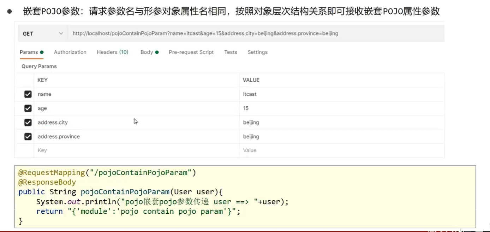

# 1. SpringMVC概述

`SpringMVC`是处于Web层的框架

* 接收前端的请求和数据,经过处理再响应给前端。

`SpringMVC`的核心：

* 如何处理请求和响应

什么是REST：

* 一种软件架构风格，可以降低开发的复杂性，提高系统的可伸缩性

将后端服务器`Servlet`拆分成三层，分别是`web`、`service`和`dao`

- web层主要由`servlet`来处理，负责页面请求和数据的收集以及响应结果给前端
- service层主要负责**业务逻辑的处理**
- dao层主要负责数据的增删改查操作

>  servlet模式处理请求和数据的问题:只能处理一个请求

MVC设计模式: 三层模式`controller`、`view`和`Model`

- `controller`负责请求和数据的**接收**，接收后将其**转发**给service进行业务处理
- `service`根据需要会**调用dao**对数据进行**增删改查** (隔一层白手套)
- `dao`把数据处理完后将结果交给`service`, `service`再交给`controller`
- `controller`根据需求组装成`Model`和`View`, `Model`和`View`组合起来生成页面转发给前端浏览器
- 这样做的好处就是`controller`可以**处理多个请求**，并对请求进行分发，执行不同的业务操作

`View`主要是异步调用:

* 一个可以无需等待被调用函数的返回值就让操作继续进行的方法
* 异步调用就是你 喊 你朋友吃饭 ，你朋友说知道了 ，待会忙完去找你 ，你就去做别的了。
* 同步调用就是你 喊 你朋友吃饭 ，你朋友在忙 ，你就一直在那等，等你朋友忙完了 ，你们一起去。

前端如果通过**异步调用**的方式进行交互，后台就需要将返回的**数据转换成`json`格式**进行返回

`SpringMVC`主要负责的就是

- `controller`如何接收请求和数据
- 如何将请求和数据转发给业务层
- 如何将响应数据转换成`json`发回到前端


# 2. SpringMVC入门案例

`SpringMVC`的制作过程:

1. 创建web工程(Maven结构)

2. 设置tomcat服务器，加载web工程(tomcat插件)

3. 导入坐标(`SpringMVC`+`Servlet`)

4. 定义处理请求的功能类(`UserController`)

   ```java
   @Controller
   public class UserController {
       //处理请求
       @RequestMapping("/save")
       @ResponseBody
       public String save(){
           System.out.println("user save....");
           return "{'info':'springmvc'}";
       }
   }
   ```

5. 设置请求映射(配置映射关系)

   ```java
   @Configuration
   @ComponentScan("com.chen.controller")
   public class SpringMvcConfig {
   }
   ```

6. 将`SpringMVC`设定加载到`Tomcat`容器中

```xml
<!--导入坐标(`SpringMVC`+`Servlet`)-->
<dependencies>
    <dependency>
      <groupId>javax.servlet</groupId>
      <artifactId>javax.servlet-api</artifactId>
      <version>3.1.0</version>
      <scope>provided</scope>
    </dependency>
    <dependency>
      <groupId>org.springframework</groupId>
      <artifactId>spring-webmvc</artifactId>
      <version>5.2.10.RELEASE</version>
    </dependency>
  </dependencies>

  <build>
    <plugins>
      <plugin>
        <groupId>org.apache.tomcat.maven</groupId>
        <artifactId>tomcat7-maven-plugin</artifactId>
        <version>2.1</version>
        <configuration>
          <port>80</port>
          <path>/</path>
        </configuration>
      </plugin>
    </plugins>
  </build>
```

servlet的坐标为什么需要添加`<scope>provided</scope>`?

- 如果不设置默认是`compile`在在编译、运行、测试时均有效
- 如果运行有效的话就会和tomcat中的servlet-api包发生冲突，导致启动报错
- provided代表的是该包只在编译和测试的时候用，运行的时候无效直接使用tomcat中的，就避免冲突

快速配置`SpringMVC`开发

1. 将`web.xml`删除，换成`ServletContainersInitConfig` （初始化容器的配置类，加载SpringMVC容器，并设置请求拦截的路径）
2. `AbstractDispatcherServletInitializer` 提供了三个接口方法供用户实现

```java
public class ServletContainersInitConfig extends AbstractDispatcherServletInitializer {
    //加载springmvc配置类
    protected WebApplicationContext createServletApplicationContext() {
        //初始化WebApplicationContext对象
        AnnotationConfigWebApplicationContext ctx = new AnnotationConfigWebApplicationContext();
        //加载指定配置类
        ctx.register(SpringMvcConfig.class);
        return ctx;
    }
    //设置由springmvc控制器处理的请求映射路径
    protected String[] getServletMappings() {
        return new String[]{"/"};
    }
    //加载spring配置类
    protected WebApplicationContext createRootApplicationContext() {
        AnnotationConfigWebApplicationContext ctx = new AnnotationConfigWebApplicationContext();
        //加载指定配置类
        ctx.register(SpringConfig.class);
        return ctx;
    }
}
```


## 2.1 入门案例的工作流程分析

启动服务器初始化过程


1. 服务器启动，执行`ServletContainersInitConfig`类，初始化`web容器`

```
public class ServletContainersInitConfig extends AbstractDispatcherServletInitializer {...}
```

2. 执行`createServletApplicationContext`方法，创建了`WebApplicationContext`

```java
//加载springmvc配置类
protected WebApplicationContext createServletApplicationContext() {
    //初始化WebApplicationContext对象
    AnnotationConfigWebApplicationContext ctx = new AnnotationConfigWebApplicationContext();
    //加载指定配置类
    ctx.register(SpringMvcConfig.class);
    return ctx;
}
```

3. 加载`SpringMvcConfig`

```java
//加载指定配置类
ctx.register(SpringMvcConfig.class);
return ctx;
```

4. 执行`@ComponentScan`加载对应的bean

```java
@Configuration
@ComponentScan("com.itheima.controller")//这个包下所有方法都是用来处理请求
public class SpringMvcConfig {
}
```

5. 加载`UserController`, 每个`@RequestMapping`的名称对应一个具体的方法

```java
@Controller
public class UserController {
    @RequestMapping("/save")//给一个调用名称,映射用来处理请求
    @ResponseBody  //设置当前控制器的响应内容为当前返回值，无需解析
    public String save(){
        System.out.println("user save ...");
        return "{'info':'springmvc'}";
    }
}
```

6. 执行`getServletMappings`方法，定义所有的请求都通过`SpringMVC`

```java
//设置由springmvc控制器处理的请求映射路径
protected String[] getServletMappings() {
    return new String[]{"/"};
}
```

**一次具体的单次请求过程：**

1. 发送请求`localhost/save`
2. web容器发现所有请求都经过`SpringMVC`, 将请求交给`SpringMVC`处理
3. 解析请求路径`/save`
4. 由/save匹配执行对应的方法save()
5. 执行save()
6. 检测到有`@ResponseBody`直接将save()方法的返回值作为响应求体返回给请求方

# 3. Controller和业务bean的加载控制

`config`目录存入的是配置类,写过的配置类有:

- `ServletContainersInitConfig`
- `SpringConfig`
- `SpringMvcConfig`
- `JdbcConfig`
- `MybatisConfig`

`controller`目录存放的是`SpringMVC`的`controller`类
`service`目录存放的是`service`接口和实现类
`dao`目录存放的是`dao/Mapper`接口

* SpringMVC加载controller等表现层bean
* Spring控制Service,config,dao等功能bean

如何避免Spring控制MVC的bean?

1. **Spring加载的bean设定扫描范围为精准范围，例如service包、dao包等(开发中主要用这种)**

```java
@ComponentScan({"com.itheima.service","com.itheima.dao"})
```

2. Spring加载的bean设定扫描范围为com.itheima, 排除掉controller包中的bean

```java
@ComponentScan(value="com.itheima",
    excludeFilters = @ComponentScan.Filter(
        type = FilterType.ANNOTATION,
        //按注解排除, 排除掉@Controller注解
        classes = Controller.class 
    )
)
```

简化开发


# 4. PostMan

[Postman](https://www.postman.com/)

Postman是一个接口测试工具, 在做接口测试的时候, Postman相当于一个客户端, 它可以模拟用户发起的各类HTTP请求, 将请求数据发送至服务端,获取对应的响应结果, 从而验证响应中的结果数据是否和预期值相匹配。

# 5. SpringMVC-设置请求映射路径

在controller类名之上加上这句,就可以有默认路径

```java
//类上方配置的请求映射与方法上面配置的请求映射连接在一起，形成完整的请求映射路径
@RequestMapping("/user") // 请求路径前缀

@Controller
//类上方配置的请求映射与方法上面配置的请求映射连接在一起，形成完整的请求映射路径
@RequestMapping("/user")
public class UserController {
    //请求路径映射
    @RequestMapping("/save")
    @ResponseBody
    public String save(){
        System.out.println("user save ...");
        return "{'module':'user save'}";
    }
    //请求路径映射
    @RequestMapping("/delete")
    @ResponseBody
    public String delete(){
        System.out.println("user delete ...");
        return "{'module':'user delete'}";
    }
}
```

## 5.1 GET和POST传递参数

传递参数：(GET和POST在后台是一样的)

* GET


* POST

  

## 5.2 过滤器-乱码处理

```java
//处理POST的乱码处理 在 `ServletContainersInitConfig` 设置过滤器
@Override
protected Filter[] getServletFilters() {
    CharacterEncodingFilter filter = new CharacterEncodingFilter();
    filter.setEncoding("UTF-8");
    return new Filter[]{filter};
}
```


如果前台写name， 后台写的userName 对应不上,怎么传?
在传参的括号中加上这一句 ,也可以映射上 不同的参数名

```java
@RequestParam("name") //把请求中的参数给到userName
```

# 6 请求参数传递

## 6.1 5种参数传递

* 普通参数

```Java
//普通参数：请求参数名与形参名不同时，使用@RequestParam注解关联请求参数名称与形参名称之间的关系
@RequestMapping("/commonParamDifferentName")
@ResponseBody
//@RequestParam("name")把请求中的参数给到userName
public String commonParamDifferentName(@RequestParam("name") String userName , int age){
   System.out.println("普通参数传递 userName ==> "+userName);
   System.out.println("普通参数传递 age ==> "+age);
   return "{'module':'common param different name'}";
}
```

* 传递实体类：

  

* 传递嵌套实体类：

  

* 数组参数传递：

  

* 集合参数传递：

  

## 6.2 JSON格式传参

1. pom.xml文件中导入

```xml
<dependency>
    <groupId>com.fasterxml.jackson.core</groupId>
    <artifactId>jackson-databind</artifactId>
    <version>2.13.0</version>
</dependency>
```

2. 发送JSON数据

   

3. SpringMvc配置类上添加

   ```java
   //开启json数据类型自动转换
   @EnableWebMvc
   ```

4. 添加@RequestBody

   

POJO对象的JSON与其数组传递同理


## 6.3 日期型类型参数传递


# 7. 响应参数传递


* 页面响应

  

* 文本数据

  

* 响应JSON数据（对象转JSON）

  

* JSON数据（对象集合转JSON数组）

  

