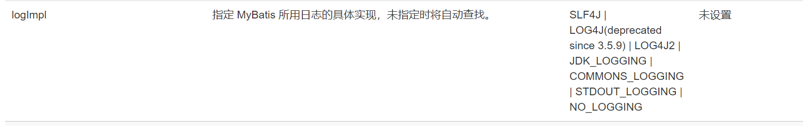
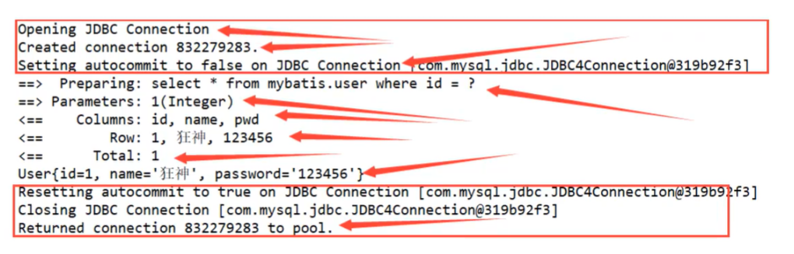
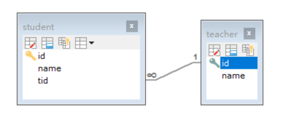
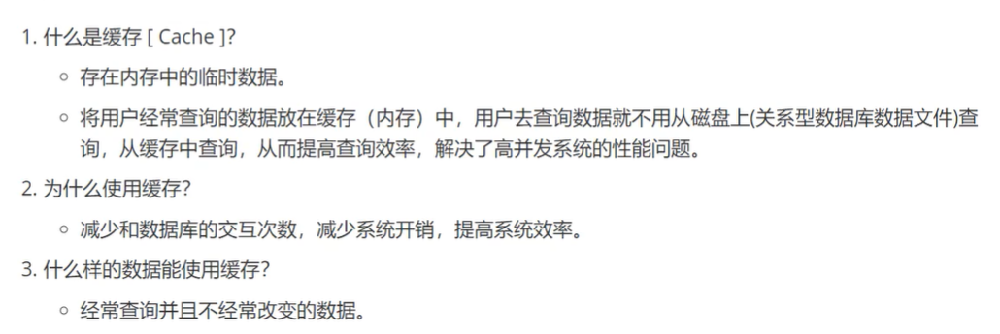
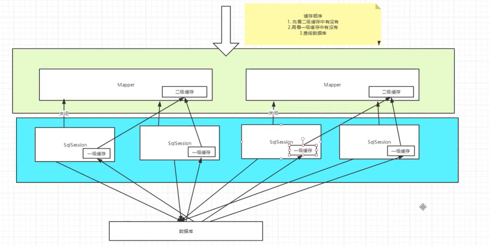

# Mybatis

## 1. 简介

### 1.1 简介和下载

* MyBatis 是一款优秀的持久层框架，它支持自定义 SQL、存储过程以及高级映射。

* MyBatis 免除了几乎所有的 JDBC 代码以及设置参数和获取结果集的工作。

* MyBatis 可以通过简单的 XML 或注解来配置和映射原始类型、接口和 Java POJO（实体类）（Plain Old Java Objects，普通老式 Java 对象）为数据库中的记录。

下载：

* maven仓库：[Maven Repository: org.mybatis » mybatis (mvnrepository.com)](https://mvnrepository.com/artifact/org.mybatis/mybatis)

  ```xml
  <!-- https://mvnrepository.com/artifact/org.mybatis/mybatis -->
  <dependency>
      <groupId>org.mybatis</groupId>
      <artifactId>mybatis</artifactId>
      <version>3.5.7</version>
  </dependency>
  ```

* github：[Releases · mybatis/mybatis-3 (github.com)](https://github.com/mybatis/mybatis-3/releases)

* 中文文档：[mybatis – MyBatis 3 | 简介](https://mybatis.org/mybatis-3/zh/index.html)

### 1.2 持久层

数据持久化

* 内存断电既失
* 数据库（jdbc），io文件持久化

### 1.3 持久层

Dao层，Service层，Controller层

持久层：完成持久化工作的代码块

### 1.4 为什么需要mybatis

方便，简化JDBC代码。框架。自动化。

不用mybatis也可以，但是学了更容易上手。

优点：

* sql和代码分离

* 提供映射标签，支持对象与数据库的orm字段关系映射。
* 提供对象关系映射标签，支持对象关系组建维护。
* 提供xml标签，支持编写动态sql。

## 2. 第一个Mybatis程序

思路：搭建环境-->导入Mybatis-->编写代码-->测试

### 2.1 搭建数据库

```java
CREATE DATABASE `mybatis`;
USE `Mybatis`;

CREATE TABLE `user`(
	`id` INT(20) NOT NULL PRIMARY KEY,
	`name` VARCHAR(30) DEFAULT NULL,
	`pwd` VARCHAR(30) DEFAULT NULL
)ENGINE=INNODB DEFAULT CHARSET=utf8;


INSERT INTO `user`(`id`, `name`, `pwd`) VALUES
(1,'chenwen','123456'),
(2,'chenwen1','123456'),
(3,'chenwen2','123456')
```

新建项目：

1. 新建普通maven项目

2. 删除src目录

3. 导入maven依赖

   ```xml
   <!--导入依赖-->
       <properties>
           <maven.compiler.source>8</maven.compiler.source>
           <maven.compiler.target>8</maven.compiler.target>
       </properties>
   
       <dependencies>
           <!--mysql驱动-->
           <dependency>
               <groupId>mysql</groupId>
               <artifactId>mysql-connector-java</artifactId>
               <version>5.1.47</version>
           </dependency>
           <!--mybatis-->
           <dependency>
               <groupId>org.mybatis</groupId>
               <artifactId>mybatis</artifactId>
               <version>3.5.7</version>
           </dependency>
           <!--junit-->
           <dependency>
               <groupId>junit</groupId>
               <artifactId>junit</artifactId>
               <version>4.12</version>
           </dependency>
       </dependencies>
   ```

### 2.2 创建一个模块

1. 编写mybatis核心配置文件

   ```xml
   <!--核心配置文件-->
   <configuration>
       <environments default="development">
           <environment id="development">
               <transactionManager type="JDBC"/>
               <dataSource type="POOLED">
                   <property name="driver" value="com.mysql.jdbc.Driver"/>
                   <property name="url" value="jdbc:mysql://localhost:3306/mybatis?useSSL=true&amp;useUnicode=true&amp;characterEncoding=UTF-8"/>
                   <property name="username" value="root"/>
                   <property name="password" value="123456"/>
               </dataSource>
           </environment>
       </environments>
   </configuration>
   ```

2. 编写mybatis的工具类

   ```java
   public class MybatisUtils {
       private static SqlSessionFactory sqlSessionFactory;
       static {
           try {
               // 使用mybatis第一步获取sqlSessionFactory对象
               String resource = "mybatis-config.xml";
               InputStream inputStream = Resources.getResourceAsStream(resource);
               sqlSessionFactory = new SqlSessionFactoryBuilder().build(inputStream);
           } catch (IOException e) {
               e.printStackTrace();
           }
       }
   
       //既然有了 SqlSessionFactory，顾名思义，我们可以从中获得 SqlSession 的实例。
       //SqlSession 提供了在数据库执行 SQL 命令所需的所有方法。
       public static SqlSession getSqlSession(){
           return sqlSessionFactory.openSession();
       }
   }
   ```

### 2.3  编写代码

1. 实体类

```java
public class User {
    private int id;
    private String name;
    private String pwd;

    public User() {
    }
    public User(int id, String name, String pwd) {
        this.id = id;
        this.name = name;
        this.pwd = pwd;
    }

    public int getId() {
        return id;
    }

    public String getName() {
        return name;
    }

    public String getPwd() {
        return pwd;
    }

    public void setId(int id) {
        this.id = id;
    }

    public void setName(String name) {
        this.name = name;
    }

    public void setPwd(String pwd) {
        this.pwd = pwd;
    }
}
```

2. Dao接口

```java
public interface UserDao {
    List<User> getUserList();
}
```

3. 接口实现类由原来的UserDaoImp转换为UserMapper.xml

```xml
<?xml version="1.0" encoding="UTF-8" ?>
<!DOCTYPE mapper
        PUBLIC "-//mybatis.org//DTD Mapper 3.0//EN"
        "http://mybatis.org/dtd/mybatis-3-mapper.dtd">

<!--namespace绑定一个对应的Dao/Mapper接口-->
<mapper namespace="com.chen.dao.UserDao">
    <!--select id="getUserList" 对应Dao里方法的名字-->
    <select id="getUserList" resultType="com.chen.pojo.User">
        select * from mybatis.user
    </select>
</mapper>
```

4. 测试

经常会遇到这个错

org.apache.ibatis.binding.BindingException: Type interface com.chen.dao.UserDao is not known to the MapperRegistry.

>  每一个mapper.xml都需要再核心配置文件中注册

```xml
<?xml version="1.0" ?>
<!DOCTYPE configuration
        PUBLIC "-//mybatis.org//DTD Config 3.0//EN"
        "http://mybatis.org/dtd/mybatis-3-config.dtd">
<!--核心配置文件-->
<configuration>
    <environments default="development">
        <environment id="development">
            <transactionManager type="JDBC"/>
            <dataSource type="POOLED">
                <property name="driver" value="com.mysql.jdbc.Driver"/>
                <property name="url" value="jdbc:mysql://localhost:3306/mybatis?useSSL=false&amp;useUnicode=true&amp;characterEncoding=UTF8"/>
                <property name="username" value="root"/>
                <property name="password" value="123456"/>
            </dataSource>
        </environment>
    </environments>

    <!--每一个mapper.xml都需要再核心配置文件中注册-->
    <mappers>
        <mapper resource="com/chen/dao/UserMapper.xml"/>
    </mappers>
</configuration>
```

```java
package com.chen.dao;

import com.chen.pojo.User;
import com.chen.utils.MybatisUtils;
import org.apache.ibatis.session.SqlSession;
import org.junit.Test;

import java.util.List;

public class UserDaoTest {
    @Test
    public void test(){

        //获取sqlSession对象
        SqlSession sqlSession = MybatisUtils.getSqlSession();
        //执行方式一 getMapper
        UserDao userDao = sqlSession.getMapper(UserDao.class);
        List<User> userList = userDao.getUserList();

        // 方式2
        List<User> userList2 = sqlSession.selectList("com.chen.dao.UserDao.getUSERlist");

        for(User user: userList2){
            System.out.println(user);
        }
        // 关闭sqlSession
        sqlSession.close();
    }
}
```

## 3. CRUD

### 3.1 namespace

namespace绑定一个对应的Dao/Mapper接口,包名要一致

### 3.2 select

1. 编写接口

   ```java
   //根据id查询用户
   User getUserByID(int id);
   ```

2. 编写对应的mapper中的sql语句

   ```xml
   <!--select id="getUserList" 对应Dao里方法的名字-->
   <select id="getUserList" resultType="com.chen.pojo.User">
       select * from mybatis.user
   </select>
   ```

3. 测试

   ```java
   @Test
   public void test(){
   
       //获取sqlSession对象
       SqlSession sqlSession = MybatisUtils.getSqlSession();
   
       try{
           //执行方式一 getMapper
           UserMapper userMapper = sqlSession.getMapper(UserMapper.class);
           List<User> userList = userMapper.getUserList();
   
           // 方式2
           //List<User> userList2 = sqlSession.selectList("com.chen.dao.UserMapper.getUSERlist");
   
           for(User user: userList){
               System.out.println(user);
           }
       }catch (Exception e){
           e.printStackTrace();
       }finally {
           // 关闭sqlSession
           sqlSession.close();
       }
   }
   ```

选择查询语句：

* id：就是对应namespace中的方法名
* resultType:  select语句的返回值
* parameterType： 参数类型

### 3.3 insert、update、delete

上同，测试时候需要多一个提交事务

```xml
<select id="getUserByID" parameterType="int" resultType="com.chen.pojo.User">
    select * from mybatis.user where id = #{id}
</select>

<!-- 对象中的属性可以直接拿出来-->
<insert id="addUser" parameterType="com.chen.pojo.User">
    insert into mybatis.user (id, name , pwd) values (#{id}, #{name}, #{pwd})
</insert>

<update id="updateUser" parameterType="com.chen.pojo.User">
    update mybatis.user
    set name = #{name}, pwd=#{pwd}
    where id=#{id};
</update>
```

### 3.4 万能的map

```java
// 万能的map
int addUser2(Map<String, Object> map);
```

```xml
<!--传递map的key 多个参数s-->
<insert id="addUser2" parameterType="Map">
    insert into mybatis.user (id, name , pwd) values (#{userid}, #{userName}, #{userPWD})
</insert>
```

```java
// 增删改杀需要提交事务
@Test
public void addUser2(){
    //获取sqlSession对象
    SqlSession sqlSession = MybatisUtils.getSqlSession();
    UserMapper userMapper = sqlSession.getMapper(UserMapper.class);
    Map<String, Object> map = new HashMap<>();
    map.put("userid", 7);
    map.put("userName", "cascsa");
    map.put("userPWD", "123123123");
    int res = userMapper.addUser2(map);
    if(res>0){
        System.out.println("插入成功！");
    }
    // 增删改杀需要提交事务
    sqlSession.commit();
    // 关闭sqlSession
    sqlSession.close();
}
```

## 4. 配置解析

[mybatis – MyBatis 3 | 配置](https://mybatis.org/mybatis-3/zh/configuration.html)

MyBatis 的配置文件 mybatis-config.xml

包含了会深深影响 MyBatis 行为的设置和属性信息。 配置文档的顶层结构如下：

- configuration（配置）
  - [properties（属性）](https://mybatis.org/mybatis-3/zh/configuration.html#properties)
  - [settings（设置）](https://mybatis.org/mybatis-3/zh/configuration.html#settings)
  - [typeAliases（类型别名）](https://mybatis.org/mybatis-3/zh/configuration.html#typeAliases)
  - [typeHandlers（类型处理器）](https://mybatis.org/mybatis-3/zh/configuration.html#typeHandlers) 了解即可
  - [objectFactory（对象工厂）](https://mybatis.org/mybatis-3/zh/configuration.html#objectFactory)了解即可
  - [plugins（插件） ](https://mybatis.org/mybatis-3/zh/configuration.html#plugins)了解即可
  - environments（环境配置）
    - environment（环境变量）
      - transactionManager（事务管理器）
      - dataSource（数据源）
  - [databaseIdProvider（数据库厂商标识）](https://mybatis.org/mybatis-3/zh/configuration.html#databaseIdProvider)
  - [mappers（映射器）](https://mybatis.org/mybatis-3/zh/configuration.html#mappers)

### 4.1 环境配置（environments）

MyBatis 可以配置成适应多种环境

**不过要记住：尽管可以配置多个环境，但每个 SqlSessionFactory 实例只能选择一种环境。**

- **每个数据库对应一个 SqlSessionFactory 实例**

**事务管理器（transactionManager）**: 默认JDBC

**数据源（dataSource）**：默认dataSource 元素使用标准的 JDBC 数据源接口来配置 JDBC 连接对象的资源。

### 4.2 属性（properties）

我们可以通过properties属性来实现引用配置文件

这些属性可以在外部进行配置，并可以进行动态替换。你既可以在典型的 Java 属性文件中配置这些属性，也可以在 properties 元素的子元素中设置。【db.properties】

编写一个数据库配置文件 【db.properties】

```properties
driver=com.mysql.jdbc.Driver
url=jdbc:mysql://localhost:3306/mybatis?useSSL=false&amp;useUnicode=true&amp;characterEncoding=UTF8
username=root
password=123456
```

在核心配置文件引入

```properties
<!--引入外部配置文件-->
<properties resource="db.properties"/>
```

### 4.3 类型别名（typeAliases）

类型别名可为 Java 类型设置一个缩写名字。 它仅用于 XML 配置，意在降低冗余的全限定类名书写。

```xml
<!--起别名    -->
<typeAliases>
    <typeAlias type="com.chen.pojo.User" alias="User"/>
</typeAliases>
```

也可以指定一个包名，MyBatis 会在包名下面搜索需要的 Java Bean，比如：

```xml
<typeAliases>
  <package name="com.chen.pojo"/>
</typeAliases>
```

在没有注解的情况下，会使用 Bean 的首字母小写的非限定类名来作为它的别名。 比如 `domain.blog.Author` 的别名为 `author`；若有注解，则别名为其注解值。见下面的例子：

```java
@Alias("author")
public class Author {
    ...
}
```

> 实体类比较多的时候，用第二种

### 4.4 设置（settings）

这是 MyBatis 中极为重要的调整设置，它们会改变 MyBatis 的运行时行为。 

主要知道这几个：

| 设置名             | 描述                                                         | 有效值                                                       | 默认值 |
| :----------------- | :----------------------------------------------------------- | :----------------------------------------------------------- | :----- |
| cacheEnabled       | 全局性地开启或关闭所有映射器配置文件中已配置的任何缓存。     | true \| false                                                | true   |
| lazyLoadingEnabled | 延迟加载的全局开关。当开启时，所有关联对象都会延迟加载。 特定关联关系中可通过设置 `fetchType` 属性来覆盖该项的开关状态。 | true \| false                                                | false  |
| logImpl            | 指定 MyBatis 所用日志的具体实现，未指定时将自动查找。        | SLF4J \| LOG4J(deprecated since 3.5.9) \| LOG4J2 \| JDK_LOGGING \| COMMONS_LOGGING \| STDOUT_LOGGING \| NO_LOGGING | 未设置 |

### 4.5 其他

[plugins（插件） ](https://mybatis.org/mybatis-3/zh/configuration.html#plugins)了解即可：

* [MyBatis Plus](https://mvnrepository.com/artifact/com.baomidou/mybatis-plus)
* [MyBatis Generator Core](https://mvnrepository.com/artifact/org.mybatis.generator/mybatis-generator-core)

### 4.6 映射器（mappers）

注册绑定我们的Mapper文件

1. 

```xml
<!--方式一：每一个mapper.xml都需要再核心配置文件中注册-->
<mappers>
    <mapper resource="com/chen/dao/UserMapper.xml"/>
</mappers>
```

2. 

```xml
<!--方式二：使用class注册-->
<mappers>
    <mapper class="com/chen/dao/UserMapper"/>
</mappers>
```

> 接口和他的Mapper文件同名且在同一包下

3. 

```XML
<!--方式三：使用扫描包注册-->
<mappers>
    <package name="com.chen.dao"/>
</mappers>
```

>接口和他的Mapper文件同名且在同一包下

## 5. 生命周期和作用域

不同作用域和生命周期类别是至关重要的，因为错误的使用会导致非常严重的并发问题。

1. `SqlSessionFactoryBuilder`

   * 一旦创建了 `SqlSessionFactory`，就不再需要它了。 

   * 局部变量

2. `SqlSessionFactory`

   * 可以想象为数据库连接池
   * 一旦被创建就应该在应用的运行期间一直存在，没有任何理由丢弃它或重新创建另一个实例。因此 `SqlSessionFactory` 的最佳作用域是应用作用域。 

   * 最简单的就是使用单例模式或者静态单例模式。

3. `SqlSession`

   * 连接到连接池的一个请求！

   * 每个线程都应该有它自己的 SqlSession 实例。SqlSession 的实例不是线程安全的，因此是不能被共享的，所以它的最佳的作用域是请求或方法作用域。 

   * 用完一定要直接关闭

   * ```java
     try (SqlSession session = sqlSessionFactory.openSession()) {
     // 你的应用逻辑代码
     }
     ```

   * 在所有代码中都遵循这种使用模式，可以保证所有数据库资源都能被正确地关闭。

## 6.  解决属性名和数据库中的字段名不一致的问题

解决方法：

* sql语句中起别名

* **resultMap** 结果集映射----`resultMap` 元素是 MyBatis 中最重要最强大的元素。它可以让你从 90% 的 JDBC `ResultSets` 数据提取代码中解放出来，并在一些情形下允许你进行一些 JDBC 不支持的操作。实际上，在为一些比如连接的复杂语句编写映射代码的时候，一份 `resultMap` 能够代替实现同等功能的数千行代码。ResultMap 的设计思想是，对简单的语句做到零配置，对于复杂一点的语句，只需要描述语句之间的关系就行了。

  * ```xml
    <resultMap id="UserMap" type="User">
        <!--column数据库中字段  property实体类的属性， 不一样的显示写-->
        <result column="id" property="id"/>
        <result column="name" property="name"/>
        <result column="pwd" property="pwd"/>
    </resultMap>
    
    <select id="getUserByID" resultMap="UserMap">
        select * from mybatis.user where id = #{id}
    </select>
    ```


## 7. 日志

### 7.1 日志工厂

如果数据库操作出现异常，需要日志来排错。



* SLF4J 
* LOG4J (deprecated since 3.5.9)(掌握) 
* LOG4J2
* JDK_LOGGING
* COMMONS_LOGGING
* STDOUT_LOGGING（掌握）
* NO_LOGGING

> 具体使用那个日志实现，在设置中实现

```xml
<settings>
    <setting name="logImpl" value="STDOUT_LOGGING"/>
</settings>
```



### 7.2 LOG4J

Log4j

* 是Apache的一个开源项目，通过使用*Log4j*，我们可以控制日志信息输送的目的地是控制台、文件、GUI组件

* 我们也可以控制每一条日志的输出格式；
* 通过定义每一条日志信息的级别，我们能够更加细致地控制日志的生成过程。
* 最令人感兴趣的就是，这些可以通过一个[配置文件](https://baike.baidu.com/item/配置文件/286550)来灵活地进行配置，而不需要修改应用的代码。

1. 导入log4j包

   ```xml
   <dependencies>
       <dependency>
           <groupId>log4j</groupId>
           <artifactId>log4j</artifactId>
           <version>1.2.17</version>
       </dependency>
   </dependencies> 
   ```

2. 创建log4j.properties

   ```properties
   #将等级为DEBUG的日志信息输出到console和file这两个目的地，console和file的定义在下面的代码
   log4j.rootLogger=DEBUG,console,file
   
   #控制台输出的相关设置
   log4j.appender.console = org.apache.log4j.ConsoleAppender
   log4j.appender.console.Target = System.out
   log4j.appender.console.Threshold=DEBUG
   log4j.appender.console.layout = org.apache.log4j.PatternLayout
   log4j.appender.console.layout.ConversionPattern=[%c]-%m%n
   
   #文件输出的相关设置
   log4j.appender.file = org.apache.log4j.RollingFileAppender
   log4j.appender.file.File=./log/logFile.log
   log4j.appender.file.MaxFileSize=10mb
   log4j.appender.file.Threshold=DEBUG
   log4j.appender.file.layout=org.apache.log4j.PatternLayout
   log4j.appender.file.layout.ConversionPattern=[%p][%d{yy-MM-dd}][%c]%m%n
   
   #日志输出级别
   log4j.logger.org.mybatis=DEBUG
   log4j.logger.java.sql=DEBUG
   log4j.logger.java.sql.Statement=DEBUG
   log4j.logger.java.sql.ResultSet=DEBUG
   log4j.logger.java.sql.PreparedStatement=DEBUG
   ```

3. 配置其为实现，刷新

   ```xml
   <settings>
       <setting name="logImpl" value="LOG4J"/>
   </settings>
   ```

### 7.3 简单使用

[【Log4j】log4j 简单使用 + 详情](https://blog.csdn.net/weixin_44034328/article/details/105258643)

```java
import org.apache.log4j.Logger;
```

```java
static Logger log = Logger.getLogger(UserMapperTest.class);
```

```java
@Test
public void testLog() {
    log.trace("Trace Message!");
    log.debug("Debug Message!");
    log.info("Info Message!");
    log.warn("Warn Message!");
    log.error("Error Message!");
    log.fatal("Fatal Message!");
}
```

## 8. 分页

分页展示数据：

* 减少处理量

### 8.1 使用 `limit` 分页

```sql
select * from Customer LIMIT 10;–检索前10行数据，显示1-10条数据
select * from Customer LIMIT 1,10;–检索从第2行开始，累加10条id记录，共显示id为2…11
select * from Customer limit 5,10;–检索从第6行开始向前加10条数据，共显示id为6,7…15
select * from Customer limit 6,10;–检索从第7行开始向前加10条记录，显示id为7,8…16
```

使用mybatis实现分页，核心SQL

1. 接口

   ```java
   //获取全部用户(分页)
   List<User> getUserByLimit(Map<String, Integer> map);
   ```

2. Mapper.xml

   ```xml
   <!--分页查询    -->
   <select id="getUserByLimit" parameterType="map" resultMap="UserMap">
       select * from mybatis.user limit #{start}, #{end}
   </select>
   ```

3. 测试

   ```java
   @Test
   public void testLimit(){
   
       //获取sqlSession对象
       SqlSession sqlSession = MybatisUtils.getSqlSession();
       UserMapper userMapper = sqlSession.getMapper(UserMapper.class);
   
       HashMap<String, Integer> map = new HashMap<>();
       map.put("start",0);
       map.put("end",2);
   
       List<User> userList= userMapper.getUserByLimit(map);
       for (User user : userList){
           System.out.println(user);
       }
       sqlSession.close();
   }
   ```

### 8.2 分页插件

[MyBatis 分页插件 PageHelper](https://pagehelper.github.io/)

## 9. 使用注解开发

### 9.1 面向接口编程

根本原因：解耦

**关于接口的理解：**

* 接口从更深层次的理解，应是定义（规范，约束）与实现（名实分离的原则）的分离。

* 接口的本身反映了系统设计人员对系统的抽象理解。

* 接口应有两类：
  * 第一类是对一个个体的抽象，它可对应为一个抽象体(abstract class)；
  * 第二类是对一个个体某一方面的抽象，即形成一个抽象面（interface）；

### 9.2 注解实现CRUD

1. 直接在接口上实现

   ```java
   //根据id查询用户
   //方法对应多个参数时候，要加上@Param("")
   @Select("select * from mybatis.user where id = #{uid}")
   User getUserByID2(@Param("uid") int id);
   
   //查询所有用户
   @Select("select * from user")
   List<User> getUserList();
   ```

2. 在核心配置中绑定接口

   ```xml
   <mappers>
   <!--        <mapper resource="com/chen/dao/UserMapper.xml"/>-->
           <mapper class="com.chen.dao.UserMapper"/>
   <!--        <package name="com.chen.dao"/>-->
       </mappers>
   ```

3. 测试使用--记得一定要绑定接口

本质

* 反射机制

* 动态代理

### 9.3 @Param注解

* 基本数据类型和String要加上

* 引用类型不用加
* SQL对应其中设定的属性名

## 10. Lombok的使用

java库，插件，构建工具，不需要编写get set的方法

1. 导入包 

   ```XML
   <dependency>
       <groupId>org.projectlombok</groupId>
       <artifactId>lombok</artifactId>
       <version>1.18.4</version>
   </dependency>
   ```

2.  使用@Data实体类上，自动无参构造，有参构造，get，set，toString等方法

   ```java
   package com.chen.pojo;
   
   import lombok.Data;
   
   @Data
   public class User {
       private int id;
       private String name;
       private String pwd;
   }
   ```

## 11. 多对一处理

多对一：关联 子查询，联表查询

一对多：集合



```sql
USE `mybatis`;

CREATE TABLE `teacher` (
  `id` INT(10) NOT NULL,
  `name` VARCHAR(30) DEFAULT NULL,
  PRIMARY KEY (`id`)
) ENGINE=INNODB DEFAULT CHARSET=utf8

INSERT INTO teacher(`id`, `name`) VALUES (1, '秦老师'); 

CREATE TABLE `student` (
  `id` INT(10) NOT NULL,
  `name` VARCHAR(30) DEFAULT NULL,
  `tid` INT(10) DEFAULT NULL,
  PRIMARY KEY (`id`),
  KEY `fktid` (`tid`),
  CONSTRAINT `fktid` FOREIGN KEY (`tid`) REFERENCES `teacher` (`id`)
) ENGINE=INNODB DEFAULT CHARSET=utf8 

INSERT INTO `student` (`id`, `name`, `tid`) VALUES ('1', '小明', '1'); 
INSERT INTO `student` (`id`, `name`, `tid`) VALUES ('2', '小红', '1'); 
INSERT INTO `student` (`id`, `name`, `tid`) VALUES ('3', '小张', '1'); 
INSERT INTO `student` (`id`, `name`, `tid`) VALUES ('4', '小李', '1'); 
INSERT INTO `student` (`id`, `name`, `tid`) VALUES ('5', '小王', '1');
```

### 11.1 环境搭建

1. 导入lombok
2. 新建实体类Teacher，Student
3. 建立Mapper接口
4. 建立Mapper.xml
5. 在核心文件中绑定注册我们的Mapper接口或者文件
6. 测试查询是否成功

### 11.2 按照查询嵌套处理

```xml
<!--核心配置文件-->
<mapper namespace="com.chen.dao.StudentMapper">
    <!--
        思路
        1. 查询所有的学生信息
        2. 根据查询出来的学生的tid，查询对应的老师！
    -->

    <select id="getStudentList" resultMap="StudentTeacher">
        select * from student;
    </select>

    <resultMap id="StudentTeacher" type="Student">
        <result property="id" column="id"/>
        <result property="name" column="name"/>
        <!--复杂的查询需要单独处理
            对象：association
            集合: collection
        -->
        <association property="teacher" column="tid" javaType="Teacher" select="getTeacher"/>
<!--        <collection property="" column=""/>-->
    </resultMap>

    <select id="getTeacher" resultType="Teacher">
        select * from teacher where id = #{id};
    </select>

</mapper>
```

### 11.3 按照结果嵌套处理(重点)

```xml
<select id="getStudentList2" resultMap="StudentTeacher2">
    select s.id sid, s.name sname, t.name tname
    from student s, teacher
    where s.tid=t.id;
</select>

<resultMap id="StudentTeacher2" type="Student">
    <result property="id" column="sid"/>
    <result property="name" column="sname"/>
    <association property="teacher" javaType="Teacher">
        <result property="name" column="tname"/>
    </association>
</resultMap>
```

## 12 一对多处理

```java
public class Teacher {
    private int id;
    private String name;

    // 一个老师拥有多个学生
    private List<Student> students;
}
```

```java
//获取指定老师信息及其所有学生信息
Teacher getTeacher2(@Param("tid") int id);
```

```xml
<select id="getTeacher2" resultMap="TS">
    select t.id tid, t.name tname, s.id sid, s.name sname
    from teacher t, student s
    where t.id = #{tid} and s.tid=t.id
</select>

<resultMap id="TS" type="Teacher">
    <result property="id" column="tid"/>
    <result property="name" column="tname"/>
    <!--复杂的查询需要单独处理
        对象：association
        集合: collection
        集合中的泛型信息我们使用oftype
    -->
    <collection property="students" ofType="Student">
        <result property="id" column="sid"/>
        <result property="name" column="sname"/>
        <result property="tid" column="tid"/>
    </collection>
</resultMap>
```

```java
@Test
public void testTeacher(){
    //获取sqlSession对象
    SqlSession sqlSession = MybatisUtils.getSqlSession();
    TeacherMapper mapper = sqlSession.getMapper(TeacherMapper.class);

    Teacher teacher = mapper.getTeacher2(1);

    System.out.println(teacher);

    sqlSession.close();
}
```

>对象：association
>集合: collection
>
>javaType 和 ofType

注意：保证sql的可读性，属性名的问题，排查问题使用日志

面试高频：

* mysql引擎
* InnoDB底层原理
* 索引
* 索引优化

## 13 动态SQL

**就说指根据不同的条件使用自动拼接SQL**[mybatis – MyBatis 3 | 动态 SQL](https://mybatis.org/mybatis-3/zh/dynamic-sql.html)

- if
- choose (when, otherwise)
- trim (where, set)
- foreach

## 14 Mybatis缓存

> 

### 14.1一级缓存

[MyBatis](https://so.csdn.net/so/search?q=MyBatis&spm=1001.2101.3001.7020) 默认开启了一级缓存，一级缓存是在 SqlSession 层面进行缓存的。即，同一个 SqlSession ，多次调用同一个 Mapper 和同一个方法的同一个参数，只会进行一次数据库查询，然后把数据缓存到缓冲中，以后直接先从缓存中取出数据，不会直接去查数据库。默认开启，SqlSession开启到关闭之间会被缓存起来。

缓存失效：

1. 增删改操作，必定刷新缓存
2. 手动删除缓存

测试：

1. 开启日志

2. 测试在一个SqlSession查询两次相同的记录

3. 查看日志输出

   ```java
   @Test
   public void test(){
       SqlSession sqlSession = MybatisUtils.getSqlSession();
   
       UserMapper mapper = sqlSession.getMapper(UserMapper.class);
       User user1 = mapper.getUserByID(1);
       System.out.println(user1);
   
       System.out.println("===========================");
       User user2 = mapper.getUserByID(1);
       System.out.println(user2);
   
       System.out.println(user1==user2); // true
       sqlSession.close();
   }
   ```

### 14.2 二级缓存

为了解决这个问题，需要手动开启二级缓存，在 SqlSessionFactory 层面给各个 SqlSession 对象共享。默认二级缓存是不开启的，需要手动进行配置。

MyBatis 内置了一个强大的事务性查询缓存机制，它可以非常方便地配置和定制。 为了使它更加强大而且易于配置，我们对 MyBatis 3 中的缓存实现进行了许多改进。

使用步骤：

1. 核心配置文件中显式开启缓存

   ```xml
   <!--显式开启缓存 -->
   <setting name="cacheEnabled" value="true"/>
   ```

2. 在当前Mapper.xml中使用二级缓存

   ```xml
   <cache/>
   或者
   <cache
     eviction="FIFO"
     flushInterval="60000"
     size="512"
     readOnly="true"/>
   ```

3. 测试问题：实体类需要序列化，否则就会报错 [Java中为什么实体类需要实现序列化](https://blog.csdn.net/thinkingcao/article/details/75133183)

   ```java
   @Data
   public class User implements Serializable {
       private int id;
       private  String name;
       private  String pwd;
   }
   ```

默认情况下，只启用了一级缓存，它仅仅对一个会话中的数据进行缓存。

二级缓存工作机制：

* **一个会话开启一个一级缓存，当会话关闭一级缓存失效，才保存到二级缓存，新的会话查询信息可以从二级缓存获取内容。**
* 不同的mapper查出的数据会放在自己的缓存中

```xml
<cache/>
```

这个简单语句的效果如下:

- 映射语句文件中的所有 select 语句的结果将会被缓存。
- 映射语句文件中的所有 insert、update 和 delete 语句会刷新缓存。
- 缓存会使用最近最少使用算法（LRU, Least Recently Used）算法来清除不需要的缓存。默认
- 缓存不会定时进行刷新（也就是说，没有刷新间隔）。
- 缓存会保存列表或对象（无论查询方法返回哪种）的 1024 个引用。
- 缓存会被视为读/写缓存，这意味着获取到的对象并不是共享的，可以安全地被调用者修改，而不干扰其他调用者或线程所做的潜在修改。

**提示** 缓存只作用于 cache 标签所在的映射文件中的语句。如果你混合使用 Java API 和 XML 映射文件，在共用接口中的语句将不会被默认缓存。你需要使用 @CacheNamespaceRef 注解指定缓存作用域。

可用的清除策略有：

- `LRU` – 最近最少使用：移除最长时间不被使用的对象。默认
- `FIFO` – 先进先出：按对象进入缓存的顺序来移除它们。
- `SOFT` – 软引用：基于垃圾回收器状态和软引用规则移除对象。
- `WEAK` – 弱引用：更积极地基于垃圾收集器状态和弱引用规则移除对象。

### 14.3 缓存原理



### 14.4 自定义缓存 EhCache

现实`Redis`来当作缓存！`K-V`键值对

自定义缓存对象，该对象必须实现 *org.apache.ibatis.cache.Cache* 接口。

为了方便日后的开发工作和降低学习成本，我们可以使用第三方缓存，推荐使用 EhCache。

- `LRU` – 最近最少使用：移除最长时间不被使用的对象。
- `FIFO` – 先进先出：按对象进入缓存的顺序来移除它们。
- `SOFT` – 软引用：基于垃圾回收器状态和软引用规则移除对象。
- `WEAK` – 弱引用：更积极地基于垃圾收集器状态和弱引用规则移除对象。

**Maven导入所需 jar:**

整合包：MyBatis-ehcache-1.0.3.jar

**导入所需配置文件：**

ehcache.xml，下面是对配置文件的一些讲解：

```xml
<?xml version="1.0" encoding="UTF-8"?>
<ehcache xmlns:xsi="http://www.w3.org/2001/XMLSchema-instance"
 xsi:noNamespaceSchemaLocation="../config/ehcache.xsd">
 
 <!-- 磁盘保存路径 -->
 <diskStore path="D:\ehcache"/>
 
 <defaultCache 
   maxElementsInMemory="10000" 
   maxElementsOnDisk="10000000"
   eternal="false" 
   overflowToDisk="true" 
   timeToIdleSeconds="120"
   timeToLiveSeconds="120" 
   diskExpiryThreadIntervalSeconds="120"
   memoryStoreEvictionPolicy="LRU">
 </defaultCache>
 
</ehcache>
 
<!-- 
属性说明：
diskStore：指定数据在磁盘中的存储位置。
defaultCache：当借助 CacheManager.add("demoCache") 创建 Cache 时，EhCache 便会采用 <defalutCache/> 指定的的管理策略。
 
以下属性是必须的：
maxElementsInMemory - 在内存中缓存的 element 的最大数目。
maxElementsOnDisk - 在磁盘上缓存的 element 的最大数目，若是 0 表示无穷大。
eternal - 设定缓存的 elements 是否永远不过期。如果为 true，则缓存的数据始终有效，如果为 false 那么还要根据 timeToIdleSeconds，timeToLiveSeconds 判断。
overflowToDisk - 设定当内存缓存溢出的时候是否将过期的 element 缓存到磁盘上。
 
以下属性是可选的：
timeToIdleSeconds - 当缓存在 EhCache 中的数据前后两次访问的时间超过 timeToIdleSeconds 的属性取值时，这些数据便会删除，默认值是 0，也就是可闲置时间无穷大。
timeToLiveSeconds - 缓存 element 的有效生命期，默认是 0，也就是 element 存活时间无穷大。
diskSpoolBufferSizeMB - 这个参数设置 DiskStore （磁盘缓存）的缓存区大小.默认是 30MB.每个 Cache 都应该有自己的一个缓冲区。
diskPersistent - 在 VM 重启的时候是否启用磁盘保存 EhCache 中的数据，默认是 false。
diskExpiryThreadIntervalSeconds - 磁盘缓存的清理线程运行间隔，默认是 120 秒。每个 120s，相应的线程会进行一次 EhCache 中数据的清理工作。
memoryStoreEvictionPolicy - 当内存缓存达到最大，有新的 element 加入的时候， 移除缓存中 element 的策略。默认是 LRU（最近最少使用），可选的有 LFU（最不常使用）和 FIFO（先进先出）。
 -->
```

**在 xxxMapper.xml 文件中进行配置**

```、
<cache type="org.MyBatis.caches.ehcache.EhcacheCache"/>
```

如果在其他的 xxxMapper.xml 文件中也想要使用，只需在该文件下配置，namespace 为配置过得命名空间地址。

```xml
<cache-ref namespace="mapper.UserMapper"/>
```

MyBatis 默认是启用 cache 的，所以对于某一条不想被 cache 的 sql 需要把 useCache=“false” 加上。e：

```xml
<select id="selectUserById" useCache="false">
```

进行测试后，会在 `磁盘保存路径` 中产生了相关的文件。
