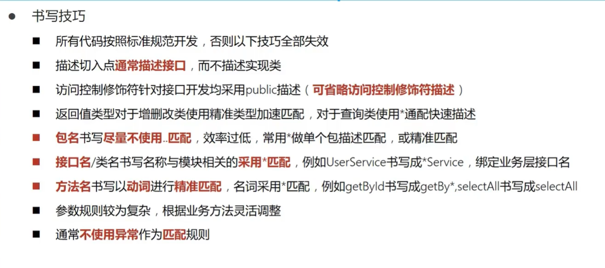

# 1 Spring

## 1.1 简介

Spring：整合了现在有的技术框架

核心部分：

* IOC：控制反转，把创建对象的过程交给Spring来管理
* AOP：面向切面，不修改源代码的进行功能增强。

特点：

* 方便解耦
* AOP编程支持
* 方便程序支持
* 方便和其他框架进行整合
* 方便进行事务的管理
* 降低API的使用难度

## 1.2 组成


## 1.3 扩展


* Spring Boot
  * 快速开发的脚手架
  * 可以快速开发单个微服务
  * 约定大于配置
* Spring Cloud
  * 基于Spring Boot实现

学习Spring Boot的前提是Spring及SpringMVC

弊端：发展太久，违背了原来的理念！配置十分繁琐，人称配置地狱。

# 2 IOC理论推导

[Spring：IOC本质分析探究 (copyfuture.com)](https://copyfuture.com/blogs-details/20190726113449466pf49hbm0qrn8wpe)

使用Set接口实现

```java
//利用set动态实现值的注入
public void setUserDao(UserDao userDao) {
    this.userDao = userDao;
}
```

从本质上解决了问题，不用再去管理对象的创建。系统的耦合性大大降低，专注于业务的实现。

这是IOC的原型。

**IOC本质**

控制反转IoC(Inversion of Control)，是一种设计思想，DI(依赖注入)是实现IoC的一种方法，也有人认为DI只是IoC的另一种说法。没有IoC的程序中 , 我们使用面向对象编程 , 对象的创建与对象间的依赖关系完全硬编码在程序中，对象的创建由程序自己控制，控制反转后将对象的创建转移给第三方，个人认为所谓控制反转就是：获得依赖对象的方式反转了。

IoC是Spring框架的核心内容，使用多种方式完美的实现了IoC，可以使用XML配置，也可以使用注解，新版本的Spring也可以零配置实现IoC。

**Spring容器在初始化时先读取配置文件，根据配置文件或元数据创建与组织对象存入容器中，程序使用时再从Ioc容器中取出需要的对象。**

控制 : 谁来控制对象的创建 , 传统应用程序的对象是由程序本身控制创建的 , 使用Spring后 , 对象是由Spring来创建的 .

反转 : 程序本身不创建对象 , 而变成被动的接收对象 .

依赖注入 : 就是利用set方法来进行注入的.

# 3 HelloSpring

```xml
<?xml version="1.0" encoding="UTF-8"?>
<beans xmlns="http://www.springframework.org/schema/beans"
       xmlns:xsi="http://www.w3.org/2001/XMLSchema-instance"
       xsi:schemaLocation="http://www.springframework.org/schema/beans
        http://www.springframework.org/schema/beans/spring-beans.xsd">

    <!-- 使用Spring创建对象，这些都被称为Bean
    bean = 对象 new Hello();

    id 变量名
    class = new的对象
    property 相当于对象属性设置了值

    -->
    <bean id="hello" class="com.cw.pojo.Hello">
        <property name="name" value="Spring"></property>
    </bean>
</beans>
```

```java
package com.cw.pojo;

public class Hello {
    private String name;

    public String getName() {
        return name;
    }
    public void setName(String name) {
        this.name = name;
    }

    public void show(){
        System.out.println("Hello"+ name );
    }
}
```

```java
import com.cw.pojo.Hello;
import org.springframework.context.ApplicationContext;
import org.springframework.context.support.ClassPathXmlApplicationContext;

public class MyTest {
    public static void main(String[] args) {
        //获取Spring的上下文对象
        ApplicationContext context = new ClassPathXmlApplicationContext("beans.xml");
        //我们的对象都在Spring中管理了，要用直接取出来。
        Hello hello = (Hello)context.getBean("hello");
        System.out.println(hello.toString());
    }
}
```

# 4 IOC创建对象的方式

1. 使用无参构造创建对象，默认

2. 假设想使用有参构造

   ```xml
   <?xml version="1.0" encoding="UTF-8"?>
   <beans xmlns="http://www.springframework.org/schema/beans"
          xmlns:xsi="http://www.w3.org/2001/XMLSchema-instance"
          xsi:schemaLocation="http://www.springframework.org/schema/beans
           http://www.springframework.org/schema/beans/spring-beans.xsd">
   
       <bean id="user" class="com.cw.pojo.User">
   <!--        无参构造-->      
   <!--        <property name="name" value="cw"/>-->
   <!--        通过下标有参构造-->
   <!--        <constructor-arg index="0" value="cw"/>-->
   <!--        通过类型有参构造-->
   <!--        <constructor-arg type="java.lang.String" value="cw"/>-->
   <!--        直接通过参数名-->
           <constructor-arg name="name" value="cw"/>
       </bean>
   </beans>
   ```

   总结：配置文件加载时候，容器中管理的对象就已经开始初始化了！

# 5 Spring的配置

## 5.1 别名

```xml
<alias name="user" alias="user2"/>
```

## 5.2 Bean的配置

 ```xml
 <!--
     id 唯一标识符
     class 包名+类名
     name 别名 别名
 -->
 <bean id="user" class="com.cw.pojo.User" name="user3 u2, u3">
         <property name="name" value="cw"/>
 </bean>
 ```

## 5.3 import

一般用于团队开发，多个配置文件导入为一个

```xml
<import resource="beans2.xml"/>
```

# 6 DI 依赖注入

## 6.1 构造注入

前面说过了

## 6.2 Set方式注入

* 依赖注入：Set注入！
  * 依赖：bean对象的创建依赖于容器
  * 注入：bean对象的所有属性由容器来注入

【环境搭建】

1. 复杂类型

   ```java
   package com.cw.pojo;
   
   public class Address {
       private String address;
   
       public String getAddress() {
           return address;
       }
   
       public void setAddress(String address) {
           this.address = address;
       }
   
       @Override
       public String toString() {
           return "Address{" +
                   "address='" + address + '\'' +
                   '}';
       }
   }
   ```
   
   

2. 真实对象

   ```java
   package com.cw.pojo;
   
   import java.util.*;
   
   public class Student {
       private String name;
       private Address address;
       private String[] books;
       private List<String> hobbys;
       private Map<String,String> card;
       private Set<String> game;
       private String wife;
       private Properties info;
   ```

3. beans.xml

   ```xml
   <?xml version="1.0" encoding="UTF-8"?>
   <beans xmlns="http://www.springframework.org/schema/beans"
          xmlns:xsi="http://www.w3.org/2001/XMLSchema-instance"
          xsi:schemaLocation="http://www.springframework.org/schema/beans
           http://www.springframework.org/schema/beans/spring-beans.xsd">
   
       <bean id="address" class="com.cw.pojo.Address"/>
   
   
       <bean id="student" class="com.cw.pojo.Student">
           <!--普通值注入 value-->
           <property name="name" value="cw"/>
           <!--Bean注入 ref-->
           <property name="address" ref="address"/>
           <!--数组注入 ref-->
           <property name="books">
               <array>
                   <value>红楼梦</value>
                   <value>西游记</value>
                   <value>三国演义</value>
               </array>
           </property>
           <!--List注入 -->
           <property name="hobbys">
               <list>
                   <value>看电影</value>
                   <value>唱歌</value>
                   <value>写代码</value>
               </list>
           </property>
           <!--Map注入 -->
           <property name="card">
               <map>
                   <entry key="身份证" value="123"/>
                   <entry key="学生证" value="321"/>
               </map>
           </property>
   
           <!--Set注入 -->
           <property name="game">
               <set>
                   <value>王者</value>
                   <value>LOL</value>
               </set>
           </property>
           <!--空值注入 -->
           <!--<property name="wife" value=""/>-->
           <!--null注入 -->
           <property name="wife">
               <null></null>
           </property>
   
           <property name="info">
               <props>
                   <prop key="学号">123456789</prop>
                   <prop key="年龄">30</prop>
               </props>
           </property>
       </bean>
   </beans>
   
   ```

   

4. 测试类

   ```java
   import com.cw.pojo.Student;
   import org.springframework.context.ApplicationContext;
   import org.springframework.context.support.ClassPathXmlApplicationContext;
   
   public class MyTest {
       public static void main(String[] args) {
           ApplicationContext context = new ClassPathXmlApplicationContext("beans.xml");
           Student student = (Student)context.getBean("student");
           System.out.println(student.toString());
       }
   }
   ```


## 6.3 扩展方式注入

[Spring Framework 中文文档 - Core Technologies | Docs4dev](https://www.docs4dev.com/docs/zh/spring-framework/5.1.3.RELEASE/reference/core.html#beans)

```xml
<?xml version="1.0" encoding="UTF-8"?>
<beans xmlns="http://www.springframework.org/schema/beans"
       xmlns:xsi="http://www.w3.org/2001/XMLSchema-instance"
       xmlns:p="http://www.springframework.org/schema/p"
       xmlns:c="http://www.springframework.org/schema/c"
       xsi:schemaLocation="http://www.springframework.org/schema/beans
        http://www.springframework.org/schema/beans/spring-beans.xsd">

    <!--p命名空间的，可以直接注入-->
    <bean id="user" class="com.cw.pojo.User" p:name="cw" p:age="18"/>
    <!--c命名空间的，可以通过构造器注入 construct-args-->
    <bean id="user2" class="com.cw.pojo.User" c:age="18" c:name="wqj"/>
</beans>
```

注意点：p命名空间和c命名空间 需要导入约束

```xml
xmlns:p="http://www.springframework.org/schema/p"
xmlns:c="http://www.springframework.org/schema/c"
```

## 6.4 bean的作用域


1. 单例模式（默认模式）

   ```xml
   <bean id="accountService" class="com.something.DefaultAccountService" scope="singleton"/>
   ```

2. 原型模式 get时候都会产生一个新对象

   ```xml
   <bean id="accountService" class="com.something.DefaultAccountService" scope="prototype"/>
   ```

3. 其余的在web开发中使用到

# 7 Bean的自动装配

Spring会在上下文中自动寻找，并自动给bean装配属性！

在Spring中有三种装配的方式：

1. 在xml中显示的配置
2. 在java中显示的配置
3. 隐式的自动装配【重要】

## 7.1 测试

环境搭建：一个人有两个宠物

## 7.2 根据名字自动装配

自动装配 autowire="byName" 会自动查找跟对象set的相同的beanid

保证所有bean的id唯一，并且和自动注入的属性的set方法的值一样

```xml
<?xml version="1.0" encoding="UTF-8"?>
<beans xmlns="http://www.springframework.org/schema/beans"
       xmlns:xsi="http://www.w3.org/2001/XMLSchema-instance"
       xsi:schemaLocation="http://www.springframework.org/schema/beans
        http://www.springframework.org/schema/beans/spring-beans.xsd">
    <bean id="cat" class="com.cw.jopo.Cat"/>
    <bean id="dog" class="com.cw.jopo.Dog"/>

    <bean id="people" class="com.cw.jopo.People" autowire="byName">
        <property name="name" value="cw"/>
<!--        <property name="cat" ref="cat"/>-->
<!--        <property name="dog" ref="dog"/>-->
    </bean>
</beans>
```

## 7.3 根据类型自动装配

自动装配 autowire="byType" 会自动查找跟对象set的相同的类型bean

id可以省略

保证所有bean的class唯一，并且和自动注入的属性的set方法的类型一样

```xml
<?xml version="1.0" encoding="UTF-8"?>
<beans xmlns="http://www.springframework.org/schema/beans"
       xmlns:xsi="http://www.w3.org/2001/XMLSchema-instance"
       xsi:schemaLocation="http://www.springframework.org/schema/beans
        http://www.springframework.org/schema/beans/spring-beans.xsd">
    <bean id="cat" class="com.cw.jopo.Cat"/>
    <bean class="com.cw.jopo.Dog"/>

    <bean id="people" class="com.cw.jopo.People" autowire="byType">
        <property name="name" value="cw"/>
<!--        <property name="cat" ref="cat"/>-->
<!--        <property name="dog" ref="dog"/>-->
    </bean>
</beans>
```

## 7.4 使用注解实现自动装配 @Autowired

需要导入约束 context

配置注解的支持

```xml
<?xml version="1.0" encoding="UTF-8"?>
<beans xmlns="http://www.springframework.org/schema/beans"
    xmlns:xsi="http://www.w3.org/2001/XMLSchema-instance"
    xmlns:context="http://www.springframework.org/schema/context"
    xsi:schemaLocation="http://www.springframework.org/schema/beans
        http://www.springframework.org/schema/beans/spring-beans.xsd
        http://www.springframework.org/schema/context
        http://www.springframework.org/schema/context/spring-context.xsd">

    <context:annotation-config/>
    <bean id="cat" class="com.cw.jopo.Cat"/>
    <bean id="dog" class="com.cw.jopo.Dog"/>
    <bean id="dog222" class="com.cw.jopo.Dog"/>
    <bean id="people" class="com.cw.jopo.People"/>

</beans>
```

```java
// @Autowired 
// 可以直接在属性上或者set方法上用就行，在属性上用，可以省略set方法
// 属性上加 @Autowired 可以省略set方法
public class People {
    
	@Autowired(required = false)
    private Cat cat;
    
    @Autowired //按类型装配
    @Qualifier(value = "dog222") // 类型相同的bean有多个时候 指定bean的名称
    private Dog dog;
}
```

科普：

``` 
@Nullable：表示特定参数，返回值或字段可以是null的 注解。
@Autowired(required = false): 说明这个对象可以为null
```

# 8 使用注解开发

自动装配的约束

```xml
<?xml version="1.0" encoding="UTF-8"?>
<beans xmlns="http://www.springframework.org/schema/beans"
       xmlns:xsi="http://www.w3.org/2001/XMLSchema-instance"
       xmlns:context="http://www.springframework.org/schema/context"
       xsi:schemaLocation="http://www.springframework.org/schema/beans
        http://www.springframework.org/schema/beans/spring-beans.xsd
        http://www.springframework.org/schema/context
        http://www.springframework.org/schema/context/spring-context.xsd">

    <context:annotation-config/>
</beans>
```

1. bean

2. 简单属性如何注入

   ```java
   package com.cw.pojo;
   
   import org.springframework.beans.factory.annotation.Value;
   import org.springframework.stereotype.Component;
   
   //等价于在bean里 <bean id="user" class="com.cw.pojo.User"/>
   //@Component 组件
   @Component
   public class User {
       //相当于 value = "cw"
       @Value("cw")
       // 或者来自配置文件
       @Value("${name}")
       public String name;
   }
   ```

3. 衍生的注解 这几个注解，都是组件的意思，代表某个类注册到容器中

   @Component有几个衍生注解，在web开发中会按照mvc三层架构分层

   * dao 【@Repository】
   * service【@Service】
   * controller 【@Controller】

4. 自动装配置

5. bean的作用域

   ```java
   @Scope("prototype") // 实现类的注解
   ```

   

6. 小结

   xml和注解：

   * xml万能 适用于各种场合
   * 注解：维护比较难 不是自己的类使用不了

   最佳实践：

   * xml来完成管理bean

   * 注解：完成属性的注入

   * 注意必须让注解生效，需要开启注解支持

     ```xml
     <!-- 指定要扫描的包   这个包下的注解就会生效 -->
     <context:component-scan base-package="com.cw"/>
     <context:annotation-config/>
     ```

# 9. 纯bean的方式配置spring

完全不使用xml

JavaConfig是Spring的子项目，现在成为了核心功能

在SpringBoot中随处可见

```java
package com.cw.pojo.config;

import com.cw.pojo.User;
import org.springframework.context.annotation.Bean;
import org.springframework.context.annotation.ComponentScan;
import org.springframework.context.annotation.Configuration;
import org.springframework.context.annotation.Import;

// 也会被容器托管，配置类 类似于beans.xml
@Configuration
@ComponentScan("com.cw.pojo")
@Import(MyConfig2.class) //导入另一个配置类
// 使用PropertySource加载properties文件
@PropertySource({"classpath:jdbc.properties"})
public class MyConfig {
	
    //使用@Bean配置第三方bean
    //@Bean 表示当前方法的返回值是一个bean
    //id = user class = 返回值
    @Bean
    public User user(){
        return new User();
    }
}

```

```java
package com.cw.pojo.config;

import org.springframework.context.annotation.Configuration;

@Configuration
public class MyConfig2 {
}
```

```java
package com.cw.pojo;

import org.springframework.beans.factory.annotation.Value;
import org.springframework.stereotype.Component;

//会被容器托管
@Component
public class User {
    private String name;

    public String getName() {
        return name;
    }
    @Value("cw")
    public void setName(String name) {
        this.name = name;
    }

    @Override
    public String toString() {
        return "User{" +
                "name='" + name + '\'' +
                '}';
    }
}
```

```java
import com.cw.pojo.User;
import com.cw.pojo.config.MyConfig;
import org.springframework.context.ApplicationContext;
import org.springframework.context.annotation.AnnotationConfigApplicationContext;

public class MyTest {
    public static void main(String[] args) {
        ApplicationContext context = new AnnotationConfigApplicationContext(MyConfig.class);
        User user = context.getBean("user", User.class);
        System.out.println(user.getName());
    }
}
```

### 总结


# 10. Spring 整合其他

## 10.1 Spring 整合 Mybatis

1. 添加依赖

   

2. 定义mybatis配置类，加入到spring的配置类中


3. 使用

   

   

## 10.1 Spring 整合 Junit


# 11 代理模式

为什么学习代理模式？因为这是SpringAOP的底层【面试容易问】

分类：

* 静态代理
* 动态代理

## 11.1 静态代理

角色分析：

* 抽象角色：用接口或者抽象类来解决

  ```java
  package com.cw.demo01;
  
  //租房
  public interface Rent {
      public void rent();
  }
  ```

  

* 真实角色：被代理的角色

  ```java
  package com.cw.demo01;
  
  //房东
  public class Host implements Rent{
      @Override
      public void rent() {
          System.out.println("房东要出租房子");
      }
  }
  ```

  

* 代理角色：代理真实角色，一般做一些附属操作

  ```java
  package com.cw.demo01;
  
  public class Proxy implements Rent{
      private Host host;
  
      public Proxy() {
      }
  
      public Proxy(Host host) {
          this.host = host;
      }
  
      @Override
      public void rent() {
          fare();
          host.rent();
      }
  
      //看房
      public void fare(){
          System.out.println("收中介费");
          System.out.println("签合同");
      }
  }
  ```

  

* 客户：访问代理对象的人

  ```java
  package com.cw.demo01;
  
  public class Client {
      public static void main(String[] args) {
          Host host = new Host();
          //代理
          Proxy proxy = new Proxy(host);
          proxy.rent();
      }
  }
  ```


代理模式的好处：

* 使真实的角色操作更加存粹
* 公共的交给代理角色
* 公告业务发生扩展时候，方便集中管理

缺点：一个真实角色会产生一个代理角色，代码量翻倍，效率低

## 11.2 动态代理

* 角色和静态代理一样
* 动态代理的代理是动态生成的
* 动态代理分为两大类
  * 基于接口：JDK 动态代理
  * 基于类的： cglib
  * java字节码

需要了解两个类：Proxy 代理，InvocationHandler 调用处理程序

**InvocationHandler **

```java
package com.cw.demo02;

import java.lang.reflect.InvocationHandler;
import java.lang.reflect.Method;
import java.lang.reflect.Proxy;

//会用这个类自动生成代理类
public class ProxyInvocationHandler implements InvocationHandler {

    //被代理的接口
    private Rent rent;

    public void setRent(Rent rent) {
        this.rent = rent;
    }

    //生成得到代理类
    public Object getProxy() {
        return Proxy.newProxyInstance(
                this.getClass().getClassLoader(),
                rent.getClass().getInterfaces(),
                this);
    }


    //处理代理实例并返回结果
    @Override
    public Object invoke(Object proxy, Method method, Object[] args) throws Throwable {
        //动态代理的本质，就是使用反射机制实现
        Object result = method.invoke(rent, args);
        return result;
    }
}
```

```java
package com.cw.demo02;


//房东
public class Host implements Rent {

    @Override
    public void rent() {
        System.out.println("房东要出租房子");
    }
}
```

```java
package com.cw.demo02;

//租房
public interface Rent {
    public void rent();
}
```

```java
package com.cw.demo02;

public class Client {
    public static void main(String[] args) {
        //真实角色
        Host host = new Host();

        //代理角色 不存在
        ProxyInvocationHandler pih = new ProxyInvocationHandler();

        //通过调用程序处理角色来处理我们要调用的接口对象
        pih.setRent(host);//设置代理对象

        Rent proxy = (Rent)pih.getProxy();// 动态生成代理类
        proxy.rent();
    }
}
```

# 12 AOP

## 12.1 什么是AOP

AOP作用：在不接触原始代码的基础上为其进行功能增强

我们称还未加入新功能的原始方法为**连接点**
我们称已经加入新功能的原始方法为**切入点**
我们称原始方法都加入的共性功能为**通知** 也就是新功能
将通知和切入点连接的方法叫**切面**
通知所在的类为**通知类**

- 连接点(JoinPoint)：程序执行过程中的任意位置，粒度为执行方法、抛出异常、设置变量等
  - 在SpringAOP中，理解为方法的执行
- 切入点(Pointcut):匹配连接点的式子
  - 在SpringAOP中，一个切入点可以描述一个具体方法，也可也匹配多个方法
    - 一个具体的方法:如com.itheima.dao包下的BookDao接口中的无形参无返回值的save方法
    - 匹配多个方法:所有的save方法，所有的get开头的方法，所有以Dao结尾的接口中的任意方法，所有带有一个参数的方法
  - 连接点范围要比切入点范围大，是切入点的方法也一定是连接点，但是是连接点的方法就不一定要被增强，所以可能不是切入点。
- 通知(Advice):在切入点处执行的操作，也就是共性功能
  - 在SpringAOP中，功能最终以方法的形式呈现
- 通知类：定义通知的类
- 切面(Aspect):描述通知与切入点的对应关系。


## 12.2 AOP在Spring中的作用

**提供声明式事务:允许用户自定义切面**

- 横切关注点:跨越应用程序多个模块的方法或功能.既是,与我们业务逻辑无关,但是我们需要关注的部分,就是横切关注点.如日志,安全,缓存,事务等…
- 切面（ASPECT）：横切关注点 被模块化 的特殊对象。即，它是一个类。
- 通知（Advice）：切面必须要完成的工作。即，它是类中的一个方法。
- 目标（Target）：被通知对象。
- 代理（Proxy）：向目标对象应用通知之后创建的对象。
- 切入点（PointCut）：切面通知 执行的 “地点”的定义。
- 连接点（JointPoint）：与切入点匹配的执行点。


SpringAOP中，通过Advice定义横切逻辑，Spring中支持5种类型的Advice:


## 12.3 使用Spring实现AOP入门案例

导入spring-context自动有AOP的包，然后需要增加一个依赖

```xml
<!-- https://mvnrepository.com/artifact/org.aspectj/aspectjweaver -->
<dependencies>
    <dependency>
        <groupId>org.aspectj</groupId>
        <artifactId>aspectjweaver</artifactId>
        <version>1.9.7</version>
    </dependency>
    <dependency>
        <groupId>org.springframework</groupId>
        <artifactId>spring-context</artifactId>
        <version>5.2.12.RELEASE</version>
    </dependency>
</dependencies>
```

使用注解实现AOP

```java
// src/main/java/com/cw/aop/MyAdvice.java 切面类
@Component // 2 加载成bean
@Aspect // 3 该类用来做AOP
public class MyAdvice {

    //4 定义好切入点
    @Pointcut("execution(void com.cw.dao.BookDao.update())")
    private void pt(){}
	
    // 5 定义好通知，@Before("pt()") 绑定切入点和通知
    @Before("pt()")
    public void method(){
        System.out.println(System.currentTimeMillis());
    }
}
```

```java
// 配置类 src/main/java/com/cw/config/SpringConfig.java
@Configuration
@ComponentScan("com.cw")
@EnableAspectJAutoProxy //1 启动了注解开发的AOP
public class SpringConfig {
}
```

## 12.3 AOP切入点表达式

1. 执行com.itheima.dao包下的BookDao**接口**中的无参数update方法

```java
execution(void com.itheima.dao.BookDao.update())
```

2. 执行com.itheima.dao.impl包下的BookDaoImpl**类**中的无参数update方法
   `execution(void com.itheima.dao.impl.BookDaoImpl.update())`

**切入点表达式标准格式：**

动作关键字（访问修饰符  返回值  包名.类/接口名.方法名（参数) 异常名 )
`execution (public User com.itheima.service.UserService.findById (int))`

**如何快速描述一组切入点方法?**  

* 使用通配符

*:单个独立的任意符号，一个 *一个包 可以独立出现，也可以作为前缀或者后缀的匹配符出现
`execution (public com.itheima.*.UserService.find*(*)`
匹配com.itheima包下的任意包中的UserService类或接口中所有find开头的带有一个参数的方法

.. : 多个连续的任意符号，代表一个或多个包可以独立出现，常用于简化包名与参数的书写

`execution(public User com..UserService.findById(..))`
匹配com包下的任意包中的JserService类或接口中所有名称为findByld的方法

`execution(* *..*(..))`
返回任意类型任意包下的任意实现类或接口,任意参数

`execution(* *..*e(..))`
匹配e结尾的方法

+:专用于匹配子类类型
`execution(**..*Service+.*(..))`

所有代码按照标准规范开发，否则以下技巧全部失效



