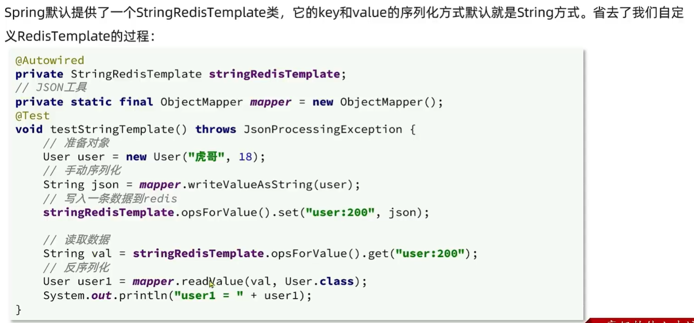

# Redis基础、实战和原理

# 1. SQL和NoSQL区别


# 2. Redis简介和安装

Redis：

* 键值型
* 单线程，每个命令具有原子性
* 低延迟，速度快（基于内存，IO复用，良好的编码）
* 支持数据持久化
* 支持主从集群、分片集群
* 支持多语言客户端

安装Redis：详细见安装说明

# 3. Redis常见命令

Redis安装完成后就自带了命令行客户端：redis-cli，使用方式如下：

```sh
redis-cli [options] [commonds]
```

其中常见的options有：

- `-h 127.0.0.1`：指定要连接的redis节点的IP地址，默认是127.0.0.1
- `-p 6379`：指定要连接的redis节点的端口，默认是6379
- `-a 123321`：指定redis的访问密码 

其中的commonds就是Redis的操作命令，例如：

- `ping`：与redis服务端做心跳测试，服务端正常会返回`pong`

## 3.1 通用命令

help 【命令】查看命令作用

常用命令 

* keys：查找所有符合的所有key
* del：删除指定的key
* exists：判断key是否存在嘛
* EXPIRE： 给一个key设置有效期
* TTL：查看一个key的剩余有效期
* get：查看key的值

## 3.2 String类型


> 补充：key的结构
>
> key:  项目名:业务名:类型:id
>
> vlaue: json的字符串

## 3.3 Hash类型

散列，其value是一个无序字典。


## 3.4 List类型

值为List，与 LinkedList 类似，可以看作双向链表结构。支持正向检索和反向检索。

特点：存储有序数据，例如朋友圈点赞列表。

* 有序
* 元素可以重复
* 插入删除快
* 查询速度一般


## 3.5 Set类型

value是一个set，与java的HashSet类似，可以看作一个value为null的HashMap。

特点：

* 无序
* 不可重复
* 查找快
* 支持交集，并集，差集等功能


## 3.6 SortedSet

value是一个可排序的set集合，与java的 TreeSet有些类似，但底层数据结构差距有点大。

SortedSet 的每一个元素带有一个 score 属性，可以基于 score 属性对元素排序，底层是一个 SkipList 加 hash 表。

特点：由于可排序，经常用来实现排行榜的功能。

* 可排序
* 元素不可重复
* 查询快


# 4. Redis 的 Java 的客户端


## 4.1 Jedis 快速入门


## 4.2 SpringDataRedis


## 4.3 SpringDataRedis 序列化方式


自动把对象转为json，但是浪费了内存开销


所以统一使用String序列化方式，但是存储 java 对象时候，手动完成对象的序列化和反序列化

## 4.4 序列化方式二 StringRedisTemplate（重点）




# 5. 点评项目大纲


# 6. 短信登录

