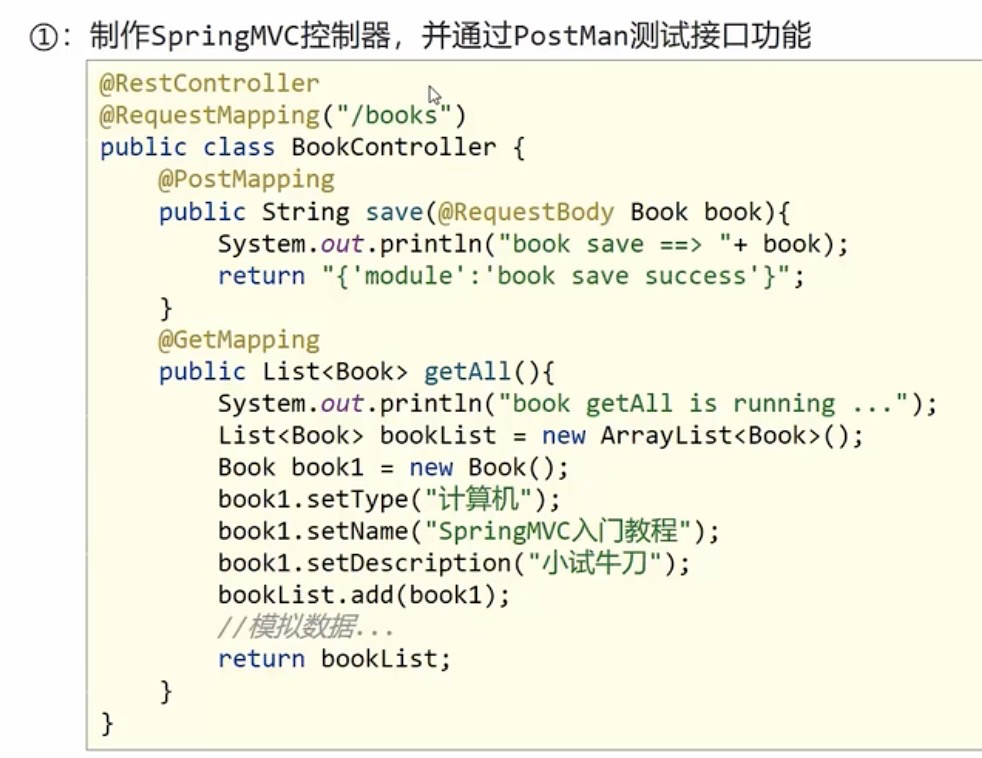
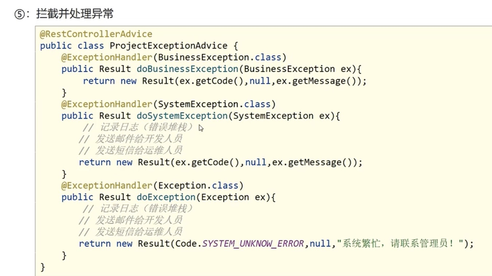
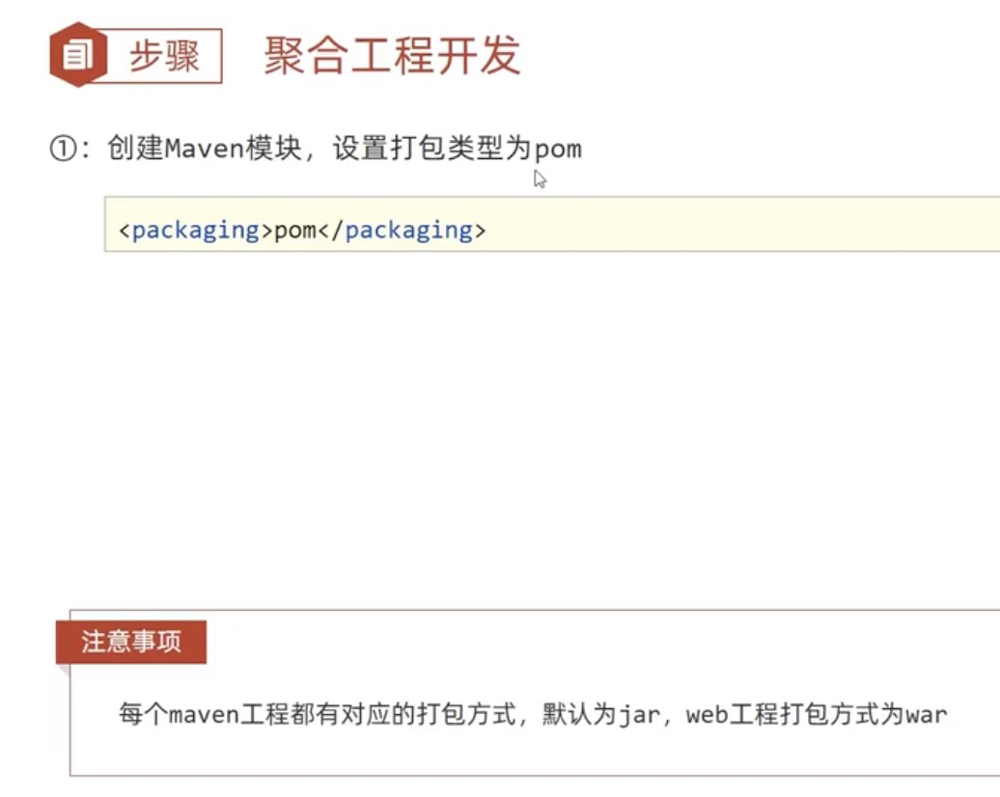
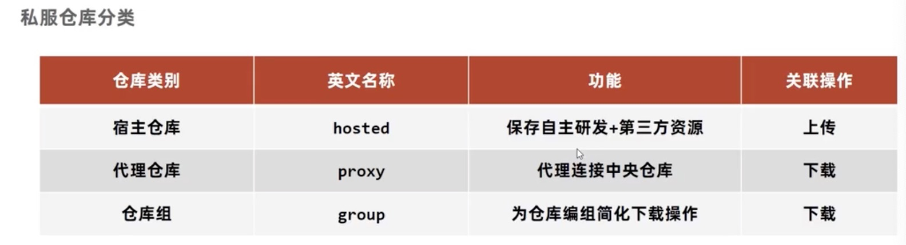
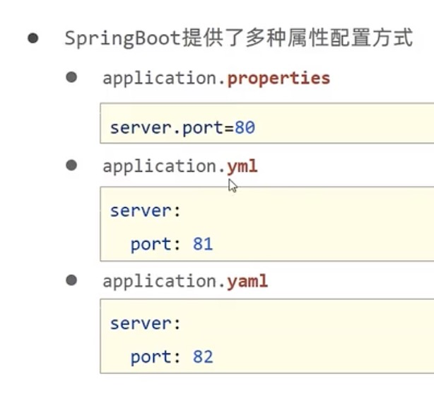
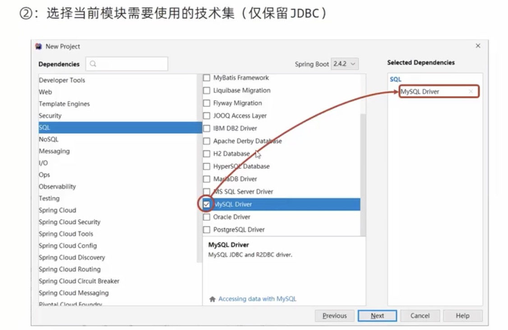
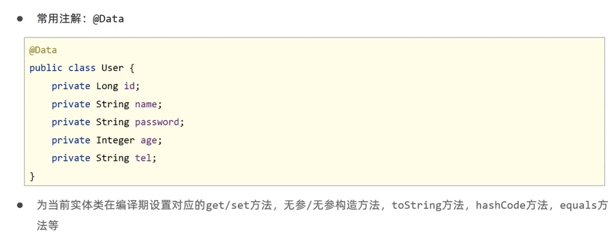
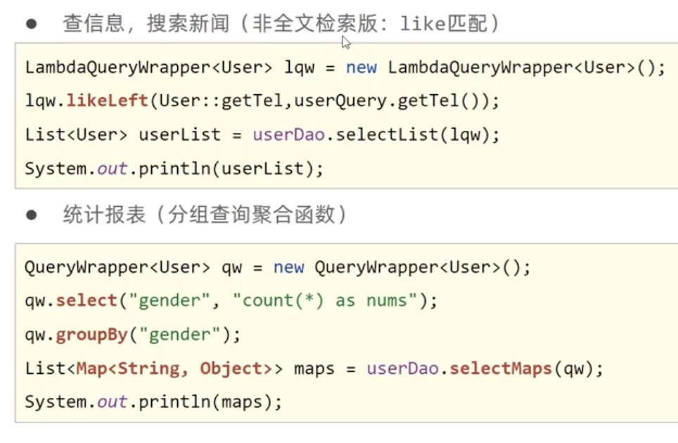
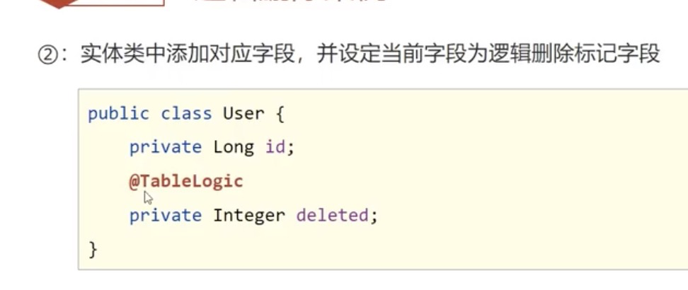

# REST 风格

使用这种风格访问资源称为RESTful

## 入门案例

## RESTful快速开发

简化Mapping

## 基于RESTful的页面数据交互

# SSM 整合

表现层整合

## 异常处理器

全部抛到表现层进行处理

## 项目异常处理

# 拦截器

## 拦截器参数

## 多个拦截器的执行顺序

# Maven进阶

## 分模块开发与设计

步骤

2 书写模块代码

## 依赖管理

* 依赖具有传递性

  * 直接依赖
  * 间接依赖

* 依赖冲突，同一个依赖版本不同

  

* 可选依赖

  

* 排除依赖

  

## 继承与聚合

******

1. 子工程添加继承

2. 父工程添加共同的依赖

   

3. 

4. 

5. 

## 属性

1. 定义属性

   

2. 

## 配置文件加载属性

版本管理

## 多环境配置和应用

## 跳过测试（了解）

## 私服

私服作用范围：自己的开发团队。

nexus-3

本来资源都在本地的maven仓库

需要修改maven的配置

# SpringBoot

## 入门案例

## 项目的快速启动

1. 
2. 

### Boot简介

一般查spring对应的boot版本

### 起步依赖

### 更换依赖项

## 基础配置

推荐 `application.yml`

###  yaml 语法格式

###  yaml 数据读取

1. 

2. 

3. 

   

###  多环境启动

###  多环境启动命令格式

###  多环境开发控制

多环境开发时候，maven和boot环境不一致，听maven的

###  配置文件分类

## Springboot 整合第三方技术

### 整合junit

### 整合Mybatis

### 整合的案例

# Mybatis-Plus

## 入门案例

## mybatis-plus 概述

国人开发

## 标准数据层开发

### 分页功能

## DQL编程控制

### 条件查询

### 条件查询之null 值处理

###  查询投影

###  查询条件

更多在官网，写的时候可以去看格式

### 字段映射和表名映射

 

## DML编程控制

增删改

### id生成

雪花算法：

### 多记录删除操作

### 逻辑删除

###  乐观锁

解决业务并发现象带来的问题：秒杀

## 代码生成器（前期了解即可，后期开发再用）

模版

